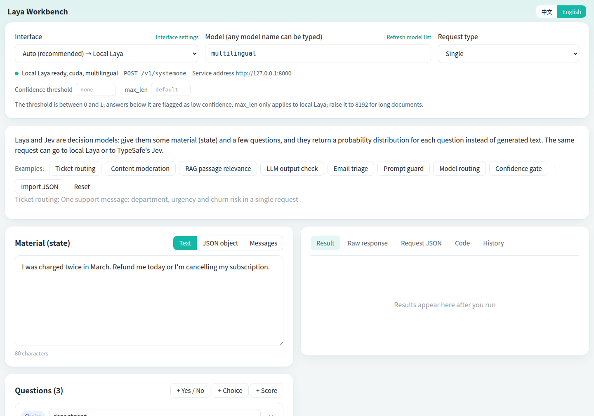
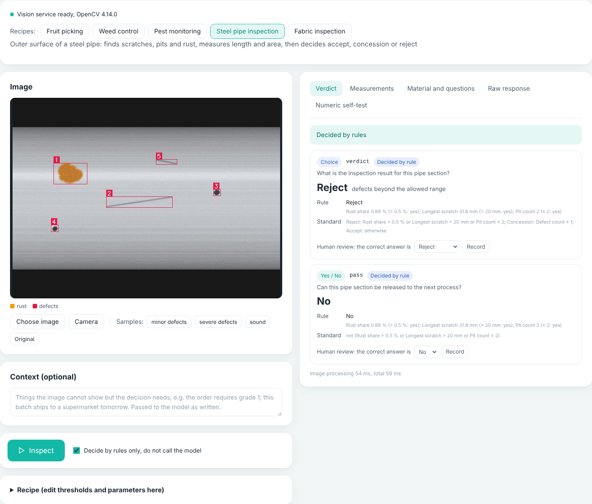
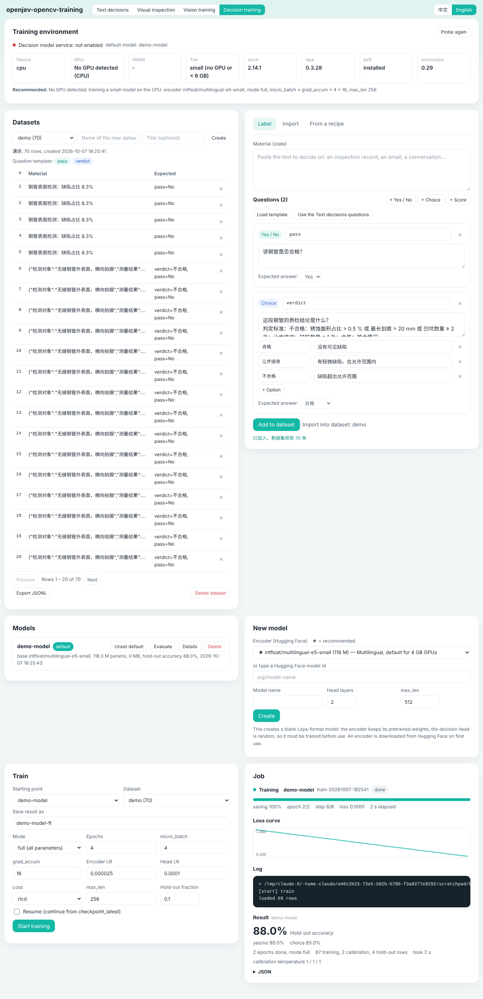
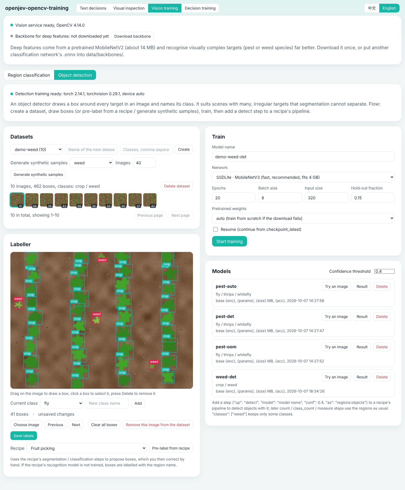

# laya-opencv

> Formerly laya-workbench (Laya Workbench). 3.0 is the upgrade of 2.0: everything 2.0 did is still here, plus decision-model training and object-detection training.

[中文](README.md) | **English**

A local workbench and one-click installer for decision models, for Windows and Linux, with a Chinese and an English interface. On top of 2.0's text decisions and visual inspection, 3.0 adds the ability to **train your own models**:

- **Decision-model training (an "open-source JEV")**: create a Laya-format decision model from any Hugging Face encoder, or fine-tune the official Laya weights; train and evaluate on your own data, then make it the default model. Trained models are served by this project's own server through the same `/v1/systemone` API, so the Text decisions tab, inspection recipes and third-party programs use them directly. A 4 GB GPU is enough for the small encoders, and a CPU works too.
- **Object-detection training**: besides the existing "segment + small classifier" approach, train a torchvision detector (SSDLite / Faster R-CNN) that draws a box around every object in an image, and use it as a step in an inspection recipe.

[Laya](https://github.com/NandhaKishorM/laya) and TypeSafe's Jev are decision models: you give them some material (state) and a few questions, and they return a probability distribution for each question instead of generated text. Laya publishes its weights and training code but ships only three official checkpoints; the "open-source JEV" turns "swap in another encoder and train a decision model with the same API on your own data" into a few steps on a web page. This project bundles the installation, start-up and training of local models with a web workbench, so the same request can go to the local model or to a remote Jev interface.



Decision models read text only; they cannot see images. Visual inspection connects the two as a pipeline:

```
image → OpenCV segmentation, recognition, detection, measurement → numeric layer (hard rules, written out as text) → decision model → rule and model cross-checked → verdict
```



The screenshot shows steel pipe inspection in "Decide by rules only" mode; the image is a synthetic sample.



The Decision training tab: training environment, datasets and labeler, model list, training jobs. Taken on a machine without a GPU, with demo data.

## Features

- One-click install: creates a virtual environment, installs PyTorch (matched to your GPU), a pinned `laya[serve]`, the training components (torchvision, peft, optional) and the vision components (OpenCV, optional); then probes the GPU, its memory and the training tier
- Decision-model training: label or import data on the page, create a model from 11 built-in encoders (or any Hugging Face model id), train in full / frozen-embeddings / LoRA mode with automatic back-off on out-of-memory, resume from checkpoints, evaluate on a hold-out set, make it the default with one click
- Decision-model service: this project's own server serves the official Laya weights and your trained models side by side, chosen by the `model` field of the request; the official weights can be left out entirely
- Object-detection training: draw boxes (or pre-label from a recipe, or generate synthetic samples), train SSDLite / Faster R-CNN, try an image, reference it in a recipe with `{"op": "detect"}`
- Visual inspection: upload an image, capture one from the camera or use a sample; a recipe measures areas, counts, lengths and shares, then each question gets a verdict
- Five built-in recipes: fruit picking, weed control, pest monitoring, steel pipe inspection, fabric inspection. Recipes are JSON files and can be edited on the page
- Numeric layer: conclusions that depend on numbers are decided by hard rules, and the model's answer is used as a cross-check; disagreement, borderline values and low confidence are flagged for human review
- Region-classifier training: upload samples per class on the page and train a recognition model that classifies regions (OpenCV's `cv2.ml`; seconds to tens of seconds on a CPU)
- Numeric self-test: generates boundary cases on both sides of every threshold to measure how well the decision model handles numbers; self-test cases and review records can be imported straight into a decision-training dataset
- Automatic updates: every start checks for a new Laya version; with a pinned version it only reports (the training scripts depend on Laya's internal API), and a failed upgrade is rolled back
- Web workbench: material as text, JSON object or message list; yes/no, choice and score questions
- Several interfaces: Auto, local Laya, TypeSafe (official), aiask.me (accelerated), and any third-party service that offers `/v1/systemone`
- Keys are added, changed and deleted on the page and stored only on your machine
- Automatic fallback when a remote interface fails; batch requests are split into single calls for remote interfaces
- Chinese and English interface, switchable at any time from the top right of the page
- 8 built-in examples in each language; add your own by dropping JSON files into `examples/`
- Result view, raw response, request JSON, code snippets (curl / Python / JavaScript), history and a debug panel
- The launcher uses only the Python standard library; the vision components need only OpenCV and numpy; everything that needs torch runs in subprocesses, and the rest works without it

## Install and start

Download the latest package from the [Releases](../../releases) page.

### Windows

1. Extract `laya-opencv-*.zip` to a permanent location, for example `D:\laya-opencv`
2. Double-click `install.bat` and wait for it to finish
3. Double-click `start.bat`; the browser opens <http://127.0.0.1:8090>

### Linux

```bash
tar -xzf laya-opencv-*.tar.gz
cd laya-opencv
bash install.sh
bash start.sh
```

Python 3.10 or newer is required. On Debian / Ubuntu run `sudo apt install python3 python3-venv` first.

On a server without a desktop, open an SSH tunnel from your own computer and then browse to <http://127.0.0.1:8090> locally:

```bash
ssh -L 8090:127.0.0.1:8090 user@server
```

The first start downloads the official model (multilingual is about 650 MB). You can run requests once the page shows "Local Laya ready". Closing the launcher window, or pressing Ctrl+C, stops everything. Once a model you trained is the default, the official model is no longer needed (clear `decision_builtin`, see Configuration).

### What the installer does

The installer can be run again at any time; finished steps are skipped. A full installation runs these steps:

```
[1/9] Prepare the virtual environment (.venv)
[2/9] Install PyTorch                                   GPU build with an NVIDIA GPU (about 2-3 GB), CPU build otherwise
[3/9] Install Laya and the server components            laya[serve]==<laya_version>, pinned to 0.4.0 by default
[4/9] Install the training components (torchvision, peft)  torchvision from the same build as torch (CUDA / CPU)
[5/9] Check the installation                            laya / torch / torchvision / peft versions, GPU availability
[6/9] Probe the GPU and the training tier               GPU, VRAM, tier (small / base / large), suggested parameters → data/decision/gpu.json
[7/9] Download the pretrained weights for object detection (optional)  mobilenet_v3_large (about 22 MB) → ~/.cache/torch/hub/checkpoints/; a failure only prints a hint
[8/9] Install the vision components (OpenCV)
[9/9] Finish up                                         creates the "laya-opencv" desktop shortcut on Windows
```

In a Chinese environment pip uses the Tsinghua mirror and model downloads go through hf-mirror.com; the pretrained weights have no mirror, so a failed download prints where to put the file by hand, and training retries the download anyway.

### Remote interfaces only

If you do not want the local model on a machine, copy `config.example.json` to `config.json`, set `install_local_laya` and `start_local_laya` to `false`, then run the installer. PyTorch, Laya and the training components are skipped and only the vision components (about 80 MB) are installed. If you do not need visual inspection either, set `install_vision` to `false` as well and the install takes a few seconds.

### Without the training components

To use the local model only for decisions and never train, set `install_training` to `false`: torchvision and peft are not installed, the Decision training tab can still manage datasets and train in full / freeze mode, but object-detection training and the lora mode are unavailable.

## Decision-model training

The fourth tab at the top, **Decision training**. The flow is **probe the environment → prepare a dataset → create a model (or pick official weights) → train → evaluate → set as default → use it in Text decisions / Visual inspection**. Command-line usage and details are in [docs/decision-training.en.md](docs/decision-training.en.md).

### Environment probe and GPU-memory tiers

The installer and the Training environment card both probe the GPU, pick a tier by memory and suggest parameters (`app/decision_train.py probe`):

| GPU memory | Tier | Suggested encoder | Suggested mode | micro_batch × grad_accum | max_len | amp |
|---|---|---|---|---|---|---|
| no GPU (CPU) | small | multilingual-e5-small | full | 4 × 16 | 256 | off |
| under 6 GB | small | multilingual-e5-small | full; lora for base-size encoders | 2 × 32 | 384 | on |
| 6 – 11 GB | base | multilingual-e5-base / mmBERT-base | full; lora for large encoders | 4 × 16 | 512 | on |
| 11 GB or more | large | ModernBERT-large / official Laya weights | full | 8 × 8 | 512 | on |

Effective batch = micro_batch × grad_accum, 64 in every tier. The training form is pre-filled for your tier and every value can be changed.

**About 4 GB GPUs**: this project was developed without a GPU. What was verified end to end on a CPU is the whole flow — `new` from a small encoder, `train` in full and lora mode, automatic OOM back-off (simulated with an environment variable), `--resume`, `evaluate`, and serving the trained model through `/v1/systemone`. The tiers and suggested parameters in the table are estimates from encoder size, sequence length and mixed precision, not measurements on a 4 GB card. Start with the defaults on your own machine: on out-of-memory the trainer halves the micro batch and then shortens max_len by itself, and every back-off is shown on the page.

### Datasets

One training row = one piece of material + a few questions + the correct answer to each, the same format as a request on the Text decisions tab (JSONL, one object per line):

```json
{"state": "Steel pipe surface inspection: defect share 8.3 %, 31 defects.",
 "questions": {
   "pass":  {"type": "noul",   "instructions": "Is this pipe acceptable?"},
   "grade": {"type": "choice", "instructions": "Defect count level", "criteria": {"few": "20 or fewer", "many": "more than 20"}},
   "score": {"type": "score",  "instructions": "Appearance score", "levels": ["poor", "fair", "good"]}
 },
 "expected": {"pass": false, "grade": "many", "score": 1}}
```

`type` is `noul` (yes/no, answer true / false), `choice` (answer is a key of `criteria`) or `score` (answer is an index into `levels` or a level text). Four ways to fill a dataset on the page:

1. **Labeler**: paste some material, add questions (the same question editor as the Text decisions tab; "Load template" and "Use the questions from Text decisions" are available), pick the correct answer for each, "Add to dataset"
2. **Import**: paste or upload JSONL (both `expected` and laya-opencv's exported `gold` form are accepted) or CSV (`text,label` columns → one choice question whose text you write)
3. **Import from an inspection recipe**: turns the numeric self-test boundary cases and human review records of the Visual inspection tab into training rows — run a few self-tests and reviews there first
4. Drop a JSONL file into `data/decision/datasets/<name>.jsonl`

Datasets can be paged through, rows deleted, and exported. A few dozen rows are enough to validate the flow; accuracy becomes stable with a few hundred or more.

### Creating a model

**New model** builds a blank Laya-format model from an encoder (pretrained encoder weights, randomly initialised decision head; it must be trained before use). The built-in suggestions (`app/decision_train.py encoders`):

| Encoder | Tier | Parameters | Languages | Note |
|---|---|---|---|---|
| `intfloat/multilingual-e5-small` | small | 118M | multilingual | default for 4 GB GPUs and CPUs |
| `sentence-transformers/paraphrase-multilingual-MiniLM-L12-v2` | small | 118M | multilingual | sentence-embedding model |
| `BAAI/bge-small-zh-v1.5` | small | 24M | Chinese | smallest |
| `BAAI/bge-base-zh-v1.5` | base | 102M | Chinese | |
| `intfloat/multilingual-e5-base` | base | 278M | multilingual | |
| `jhu-clsp/mmBERT-base` | base | 307M | multilingual | the base of Laya multilingual |
| `answerdotai/ModernBERT-base` | base | 149M | English | |
| `answerdotai/ModernBERT-large` | large | 395M | English | |
| `convaiinnovations/laya-multilingual` | base | 307M | multilingual | official Laya multilingual weights, a fine-tuning start |
| `convaiinnovations/laya` | large | 395M | English | official Laya English weights, a fine-tuning start |
| `convaiinnovations/laya-typed-decisions` | large | 395M | English | official typed-decisions weights, a fine-tuning start |

Any Hugging Face encoder id (bidirectional encoders such as BERT / RoBERTa / XLM-R / ModernBERT) or a local folder works too. The three official checkpoints need no "New model": pick them as the starting point in the training form; they are downloaded on first use. Encoders are downloaded through `hf_endpoint` (hf-mirror.com in a Chinese environment).

### Training

The training form: starting point (an existing model / official weights), dataset, mode, epochs, micro_batch, grad_accum, encoder and head learning rates, loss (`rlcd` is Laya's default reinforcement-style loss, `soft-ce` is soft cross-entropy), max_len, hold-out fraction, resume.

- **Mode** `full`: every parameter is trained. `freeze`: the encoder's input embeddings are frozen, the rest trains (gentler than Laya's own "freeze the whole encoder"; makes base-size models usable on 4 GB). `lora`: peft adds LoRA adapters to the encoder (`r` 16 by default) and only the adapters and the head are trained, which saves a lot of memory; **the adapters are merged back before saving**, so what lands on disk is an ordinary Laya checkpoint and the server does not know the difference
- **Automatic back-off on out-of-memory**: on OOM the micro batch is halved (grad_accum doubled, so the effective batch stays the same) down to 1; if it still fails, max_len drops to 384 and then 256; only then is an error reported, suggesting lora or a smaller encoder
- **Resume**: `checkpoint_latest` is saved after every epoch; tick "Resume" to continue from it up to the target number of epochs (`train.json` records the epochs done)
- **The model service pauses during training**: when training on the GPU, the launcher stops the local decision service first to free the memory; the Text decisions tab shows "Model service paused: training", and the service comes back once training ends (success or failure)
- Progress bar, stage, epoch / step, loss curve and log tail are in the Jobs card, and a job can be cancelled; only one training-type job runs at a time (new / train / evaluate share one lock)
- Temperature calibration runs at the end as in Laya; with a hold-out set the result card shows hold-out accuracy, calibration, peak GPU memory and time taken

### Evaluation

Press **Evaluate** on a model in the list and pick a dataset: overall accuracy, accuracy per question type (yes/no / choice / score) and per question, plus confusion matrices. Evaluate on data that was not used for training.

### Set as default, then use it

**Set as default** writes the model name into `decision_active` in `config.json` and restarts the local decision service. After that:

- **Text decisions** tab: the drop-down button next to the **Model** box lists the official models the service registers plus your own (marked "trained here", the default one marked "default"); one click fills it in. With the box empty the hint says "Empty = the default model <name>" (while `decision_pin_default` is true, requests without a model go to it)
- **Visual inspection**: the **Decision model** drop-down in the **Models** card is the same value as the box at the top; either works. The recipe's `model` field can also name it
- **Other programs**: `POST http://127.0.0.1:8000/v1/systemone` with `"model": "<name>"` in the body, exactly the Laya format; `GET /v1/models` lists every registered model
- To stop downloading the official weights, set `decision_builtin` to `""`: the server then registers only your own models

The model folder `data/decision/models/<name>/` is a standard Laya checkpoint (`model.safetensors`, `rl_agent_config.json`, `encoder/`, `tokenizer/`, `questions.json`, `train.json`) and can be copied to another machine and loaded with Laya's own `python -m laya.serve` or this project's `decision_server.py`.

### Command line

Every step on the page maps to a sub-command of `app/decision_train.py`, which prints one JSON event per line on stdout (`start` / `log` / `progress` / `oom` / `result` / `error`), which makes it easy to script:

```bash
P=.venv/bin/python   # Windows: .venv\Scripts\python.exe
$P app/decision_train.py probe
$P app/decision_train.py encoders
$P app/decision_train.py new --encoder intfloat/multilingual-e5-small --out data/decision/models/my-model
$P app/decision_train.py train --data data/decision/datasets/demo.jsonl --base data/decision/models/my-model \
      --out data/decision/models/my-model-v1 --mode full --epochs 4 --micro-batch 2 --grad-accum 32 --max-len 384 --holdout 0.1
$P app/decision_train.py train --data ... --base multilingual --out data/decision/models/laya-ft --mode lora   # fine-tune official weights
$P app/decision_train.py train --data ... --out data/decision/models/my-model-v1 --epochs 8 --resume           # continue to 8 epochs
$P app/decision_train.py evaluate --data data/decision/datasets/test.jsonl --model data/decision/models/my-model-v1
$P app/decision_train.py info --model data/decision/models/my-model-v1
$P app/decision_server.py --port 8000 --builtin "" --custom my=data/decision/models/my-model-v1 --default my --pin-default
```

All flags are listed in [docs/decision-training.en.md](docs/decision-training.en.md).

## Object-detection training

The **Visual training** tab has two sub-tabs: **Region classification** (the former "Model training", the cv2.ml classifier) and **Object detection** (new). A detector draws a box around every object in an image and labels it, which suits scenes with many, irregular or touching objects that segmentation cannot separate. It needs `install_training` (torch + torchvision).



The screenshot is a one-epoch smoke test on a CPU with synthetic samples, so an mAP of 0 is expected; use the parameters below for real training.

### Dataset

```
data/det/datasets/<name>/images/*.jpg      images
data/det/datasets/<name>/labels/*.txt      YOLO format: one line per box, class_id cx cy w h (normalised 0-1)
data/det/datasets/<name>/classes.json      ["crop", "weed"]
data/det/models/<name>/model.pt + meta.json
```

This is the common YOLO label layout, so data labelled with LabelImg, Roboflow and similar tools can be copied in (add `classes.json`). On the page:

- **Labeler**: pick an image (or click a thumbnail to open an existing one) → drag a box on the image → choose a class → save; click a box to select it, change its class or press Delete; previous / next image
- **Pre-label from a recipe**: the segmentation / recognition steps of an existing recipe propose boxes that you then correct by hand
- **Generate synthetic samples**: the five built-in scenes produce demo data with boxes, to try the flow first

### Training

Parameters: network (`ssdlite` = SSDLite320-MobileNetV3, fast, fits 4 GB, default; `fasterrcnn_mobile` = Faster R-CNN MobileNetV3-320-FPN, slightly more accurate and slower), epochs (default 20), batch size (default 8), input size (default 320), hold-out fraction, pretrained weights (`auto`: train from scratch with a hint if the download fails; `yes`: fail if the download fails; `no`: from scratch), resume. Training runs in the subprocess `app/detect_train.py`; progress and logs are shown on the page and the job can be cancelled; on out-of-memory the batch size is halved and training retried. The result shows mAP@0.5 on the hold-out set and per-class AP, and **Try an image** draws the boxes. The defaults for 4 GB (batch 8, imgsz 320) are estimates — like decision training, the flow was verified on a CPU — and back off automatically on OOM.

**Pretrained weights**: torchvision's ImageNet backbone `mobilenet_v3_large-8738ca79.pth` (about 22 MB). The installer tries to download it into `~/.cache/torch/hub/checkpoints/` (`%USERPROFILE%\.cache\torch\hub\checkpoints\` on Windows; `TORCH_HOME` changes the location). There is no mirror; if the download fails, fetch <https://download.pytorch.org/models/mobilenet_v3_large-8738ca79.pth> yourself and put it there. Training from scratch converges too, just with more epochs and lower accuracy.

### Using it in a recipe

Add a step to the recipe's `pipeline`:

```json
{"op": "detect", "model": "weed-det", "conf": 0.4, "classes": ["weed"], "as": "regions:weeds"}
```

The regions it produces have the same structure as segmented regions (plus `label` and `prob`), so the following `count` / `class_count` / `measure` / `classify` steps use them as usual. If the model does not exist or torch is not installed, the step produces no regions, `notes` gets `model_missing:<name>`, measurements that depend on it are reported as "not measured", and rule verdicts are unaffected. Inference loads torch inside the vision service on demand; the first call takes a few seconds.

Externally trained YOLO-family ONNX detectors can still be placed in `data/onnx/` and referenced with `{"op": "detect", "model_file": ...}` (see [docs/vision.en.md](docs/vision.en.md)). Training in this project uses torchvision's models (BSD-3 license) and **does not use Ultralytics**, so the trained models carry no AGPL obligations.

## Visual inspection

The page has four tabs at the top: **Text decisions** is the original workbench; **Visual inspection**, **Visual training** and **Decision training** are the extensions.

### How to use it

1. Open **Visual inspection** and pick a recipe
2. Choose an image, capture one with the camera, or click a sample image to try the flow first
3. Press **Inspect**. The right side shows the verdict, measurements and regions, the material and questions sent to the model, the raw response, and the numeric self-test

It also works without a decision model (no local Laya and no remote key): tick **Decide by rules only**, or just inspect; questions bound to a rule still get a verdict.

### Using trained models

A **Models** card sits above the recipe editor, so no JSON editing is needed:

- **Decision model**: the same value as the **Model** box at the top of the page; lists the official models the service registers plus your own (marked "trained here" / "default"); empty = the default model
- **Region classifier**: pick a model trained under **Vision training → Region classification** and the regions group to apply it to, press **Add to recipe**: a `classify` step is inserted (or replaced) right after the step that produces that group
- **Detector**: pick a model trained under **Vision training → Object detection**, set the output regions name and confidence, press **Add to recipe**: a `detect` step is inserted (or replaced) at the start of the pipeline; **also add a count measurement** adds a `count` measurement for it
- Below, the recipe's existing classify / detect steps are listed with **Remove**. Changes apply to the current page only; press **Inspect** to see them, and use **Save as my recipe** to keep them

### Built-in recipes

| Recipe | Measures | Rules decide |
|---|---|---|
| Fruit picking | ripe-colour share, blemish share, diameter | pick or not, fruit grade |
| Weed control | cover, count and density of inter-row weeds | weed or not, treatment |
| Pest monitoring | total insects on a sticky trap, large insects, density | act or not, control level |
| Steel pipe inspection | scratch length, pit count, rust share | accept / concession / reject |
| Fabric inspection | defect count, longest defect, hole area | accept / downgrade / reject |

Each recipe also has one or two questions without a bound rule (such as "what is the best use for this fruit" or "how should it be handled"), which the decision model answers from the whole material.

The thresholds in the built-in recipes are for demonstration and are not any industry standard; the segmentation parameters are tuned for the synthetic sample images. Before real use, tune the parameters on your own images and replace the thresholds with your own standard. The full recipe format is in [docs/vision.en.md](docs/vision.en.md).

### How numbers are kept right

Decision models read text and do no arithmetic, and they only output yes/no, a choice or a score. So conclusions that depend on numbers are not left to the model:

- **Rules do the comparing**: every threshold comparison is done in code. Measurements are first rounded to the configured decimals, so the number shown is the number compared
- **Written out as text**: in the material given to the model, each number carries its comparisons, for example `99.3 % (≥ 70 %: yes, 29.3 above)`; the standard in each question uses the same wording, so the two match clause by clause
- **The rule decides**: when a question is bound to a hard rule, the rule's result is final and the model's answer is only a cross-check
- **Flagged for review**: when rule and model disagree, a measurement is inside its guard band, the model's confidence is low, or the image is blurry, too dark or too bright, the verdict is marked for human review
- **Measured, not assumed**: the numeric self-test generates boundary cases on both sides of every threshold, sends the same cases to the model once with bare numbers and once with the written comparisons, and reports agreement with the rules. Questions whose agreement is not high enough should stay rule-decided

Self-test results depend on the model and version you use; go by what your own machine reports. Self-test cases and human review records can be exported as `{state, questions, gold}` JSONL, or imported into a dataset on the Decision training tab with one click to train a model that understands your numbers better.

### Training a region classifier

Classical algorithms can measure colour, area and shape, but cannot tell which insect or which kind of defect something is. **Visual training → Region classification** fills that gap:

1. Create a dataset and upload images per class (or tick regions in an inspection result to add them directly). Each class needs at least 2 images; 30 or more is recommended
2. Pick features (colour, texture, contour gradients, shape and size, deep features) and a classifier (SVM, random forest, k nearest neighbours), then press **Start training**
3. Read the cross-validated accuracy and the confusion matrix
4. Add a step `{"op": "classify", "model": "model name", "on": "regions:region name"}` to the recipe's `pipeline`

The built-in recipes already contain this step. Click **Train a sample model from synthetic images** on the verdict tab to see recognition results appear among the measurements.

Deep features need a pretrained backbone (MobileNetV2, about 14 MB, one click on the training tab) and work much better for visually complex targets.

Dense, overlapping small objects are beyond "segment first, then classify"; use object-detection training (above) for those.

### One-shot endpoint

```bash
curl -s http://127.0.0.1:8090/v1/inspect \
  -H "Content-Type: application/json" -H "X-WB-Target: auto" \
  -d '{"recipe": "steel-pipe", "image": "<base64 or data URL>", "context": "the customer requires a rust-free surface"}'
```

The response contains the measurements, the material and questions sent to the model, the final verdict for each question (`verdicts`) and whether review is recommended (`review`). Send `values` (a set of ready-made measurements) instead of `image` to use only the numeric layer and the decision model, which lets you feed in data from other sensors.

### Limits

- The sample images are synthetic and far cleaner than real photos; results on them say nothing about real scenes
- Classical segmentation is sensitive to lighting and background, so keep the capture conditions fixed; pixel parameters in a recipe refer to the `max_side` processing size
- The region classifier is "features plus a small classifier", not a deep detection network; use object-detection training when objects need boxes
- This is a workbench for validating an approach and for small batches, not a production-line inspection system; it outputs decisions and does not drive actuators

## Automatic updates

Every time you run `start.bat` / `start.sh`, two things are checked before the local model starts:

- **The Laya program**: compared with the latest version on PyPI. While `laya_version` in `config.json` is set (pinned to `0.4.0` by default) a newer version is only reported, never installed, because the training scripts use Laya's internal API (`laya.train`, `laya.common`) and a newer version may not be compatible. To upgrade, change `laya_version` and run the installer again, or clear it to restore automatic upgrades.
- **The model files**: compared with the latest commit on Hugging Face. Laya downloads the newest files itself when it loads the model; the check only tells you in advance whether there is an update.

The outcome is printed in the launcher window, and the page shows a line under the status at the top left, for example "Laya 0.4.0 (up to date), model revision e4e9ddf2".

How the special cases are handled:

- **No network**: the check is skipped and the current version is used; start-up is not affected.
- **The service fails to start after an upgrade**: the previous version is reinstalled and the service is started again. That version is then skipped until a newer one is released.
- **The new version needs a newer PyTorch**: PyTorch is pinned to its current version during the upgrade so that a GPU build is never replaced by a CPU build. In this case the upgrade fails with a message and the current version keeps running; run the installer again to resolve it.
- **A Laya service is already running on port 8000**: the check runs, but nothing is upgraded.

Controlled by `auto_update` in `config.json`: `"check"` (default, check and report only), `true` (upgrade automatically; still check-only while `laya_version` is set), `false` (no check).

## Language

- **Page**: switch with "中文 / English" at the top right; the choice is remembered. An example you have not edited is swapped for its version in the other language.
- **Installer and launcher window**: follow the system language by default. Set `language` in `config.json` to `zh` or `en` to fix it.
- **Error messages from the service and training logs**: follow the language the page is using.

## Interfaces

The "Interface" drop-down at the top left of the page:

| Interface | Where requests go | Key |
|---|---|---|
| Auto (recommended) | Decided by the model name, see below | The key of whichever interface is used |
| Local Laya | `127.0.0.1:8000` on this machine | None |
| TypeSafe (official) | `https://api.typesafe.ai` | A key from the TypeSafe console |
| aiask.me (accelerated) | `https://aiask.me` | An aiask.me key |
| Third-party interface | The address you enter | That service's key; may be left empty |

**How Auto works**

- Model name is `multilingual`, `english`, `typed-decisions`, the name of a model you trained, or empty: local Laya is used
- Any other model name (such as `jev-latest`): the first remote interface in `auto_order` that has a key is used (aiask.me first, then TypeSafe, by default). If it is unreachable, times out or refuses the request (401 / 403 / 404 / 429 / 5xx), the next one is tried

The result view shows which interface answered, and any fallback that happened.

**Managing keys**

"Interface settings" shows only the interface that is selected under "Interface", so the keys never appear side by side:

- No key yet: paste it and click "Add key"
- Key saved: only its last 4 characters are shown; use "Change" or "Delete" (deleting asks for confirmation)
- "Test connection" fetches the model list with the current key, which confirms that the address and key work

Keys are written only to `config.json` on your machine and added to requests by the local launcher; requests sent by the browser never contain them. For TypeSafe and aiask.me the environment variables `TYPESAFE_API_KEY` and `AIASK_API_KEY` work too.

`config.json` is listed in `.gitignore` and is never committed.

**Third-party interfaces**

Pick "+ Add a third-party interface…" in the "Interface" drop-down and enter a name, base URL, key and default model. Any address that serves the `/v1/systemone` format works, for example another gateway, or a Laya service on another machine in your network.

- Enter only the host or path prefix; the workbench appends `/v1/systemone`. A full endpoint URL is accepted too and its ending is removed
- The key may be left empty, for internal services without authentication
- After adding, the name, base URL, default model and key can be changed, and the interface can be deleted
- A third-party interface is used only when selected and is not part of Auto. To include it, add its id from `config.json` (such as `custom-1`) to `auto_order`

**Differences between remote interfaces and local Laya**

- Remote interfaces have no batch endpoint. In batch mode the workbench calls `/v1/systemone` once per item and merges the results; you are billed per item
- `max_len` only applies to local Laya; for remote interfaces the confidence threshold is applied locally by the workbench
- Remote requests follow the system proxy by default; set `proxy` in `config.json` to use a specific one

## Examples

`examples/zh/` and `examples/en/` each hold one set of examples; the page shows the set for the current language. Every `.json` file is a complete request body and becomes one example button:

| File | What it shows |
|---|---|
| `01-ticket-routing.json` | Ticket routing: department, urgency, churn risk |
| `02-content-moderation.json` | Content moderation (batch) |
| `03-rag-relevance.json` | RAG passage relevance |
| `04-llm-output-check.json` | LLM output check |
| `05-email-triage.json` | Email triage (JSON object material) |
| `06-prompt-guard.json` | Prompt guard (message list material) |
| `07-model-routing.json` | Model routing (batch) |
| `08-confidence-gate.json` | Confidence gate |

Add a file in the same format and refresh the page to get another button. `_title` is the button label, `_note` a one-line description, and the remaining fields are the request. Files placed directly in `examples/` (not in a language folder) are shown in both languages.

The files can also be sent straight to local Laya with curl (fields starting with an underscore are ignored):

```bash
curl -s http://127.0.0.1:8000/v1/systemone \
  -H "Content-Type: application/json" \
  --data-binary "@examples/en/01-ticket-routing.json"
```

In Windows PowerShell write `curl.exe`. The two batch examples, which contain `states`, go to `/v1/systemone/batch`.

## Configuration

`config.json` is created from `config.example.json` on the first install or start. Restart after changing it.

| Setting | Meaning |
|---|---|
| `language` | `auto` (follow the system) / `zh` / `en`: language of the installer and launcher window, and the page's default language |
| `ui_host` / `ui_port` | Address and port of the workbench, `127.0.0.1:8090` by default |
| `open_browser` | Open the browser automatically after starting |
| `install_local_laya` | `false` = skip PyTorch, Laya and the training components during installation |
| `start_local_laya` | `false` = do not start the local model |
| `laya_host` / `laya_port` | Address of the local decision-model service, `127.0.0.1:8000` by default |
| `laya_version` | Pinned Laya version, `"0.4.0"` by default. The installer installs `laya[serve]==<it>`; while set, automatic updates only check. Empty = install the latest and restore automatic upgrades (the training scripts may stop working) |
| `install_training` | `false` = do not install torchvision and peft: no object-detection training and no lora mode |
| `decision_active` | Name of the custom decision model that is currently the default; "Set as default" on the page writes it. Empty = the official model |
| `decision_pin_default` | `true` (default) = while a custom default exists, requests without `model` all go to it (language routing off) |
| `decision_builtin` | Official models the decision service registers, comma-separated: `multilingual,english,typed-decisions`. `""` = no official model and no download of official weights (self-trained only). Falls back to `models` when the key is absent |
| `detect_device` | Device for object-detection training and inference: `auto` / `cuda` / `cpu` |
| `models` | (legacy key, used when `decision_builtin` is absent) official models registered at start |
| `default_model` | Official model used when the language cannot be detected |
| `device` | Device of the decision-model service: `auto` / `cuda` / `cpu` |
| `preload` | Load the default model at start |
| `api_key` | Access key for the local decision service, normally empty |
| `auto_update` | `"check"` (default) = check and report only; `true` = upgrade Laya automatically (still check-only while `laya_version` is set); `false` = no check |
| `install_vision` | `false` = skip OpenCV at install time; visual inspection and training are unavailable |
| `start_vision` | `false` = do not start the vision service |
| `vision_host` / `vision_port` | Address of the vision service, default `127.0.0.1:8001`; only the local launcher talks to it |
| `vision_backbone_urls` | Where to download the deep-features backbone for region classification. `auto` = hf-mirror.com first in a Chinese environment, then the official addresses; or one or more URLs separated by commas |
| `providers` | Remote interfaces: names, base URL, key, default model |
| `auto_order` | Order in which Auto tries remote interfaces |
| `proxy` | Proxy for remote interfaces and for downloading the backbone and the pretrained weights; empty = follow the system |
| `remote_timeout` | Timeout for remote requests, in seconds |
| `hf_endpoint` | Where models and encoders are downloaded from. `auto` = hf-mirror.com in a Chinese environment, Hugging Face directly otherwise; a URL or an empty value also works |
| `pip_index` | pip index used by the installer and by automatic updates. `auto` = the Tsinghua mirror in a Chinese environment, the official index otherwise; a URL or an empty value also works |
| `torch_index` | A specific PyTorch (and torchvision) index; normally empty |
| `desktop_shortcut` | Create a desktop shortcut when installing on Windows |

Environment variables: `LAYA_WB_CONFIG` (location of config.json), `LAYA_WB_DATA` (location of `data/`), `LAYA_WB_LANG` (override the language), `HF_ENDPOINT` (overrides `hf_endpoint`), `TORCH_HOME` (torchvision weight cache).

> With `ui_host` set to `0.0.0.0`, anyone who can reach the port can send requests with your saved keys. Do this only on a trusted network; otherwise keep `127.0.0.1` and use an SSH tunnel.

## Troubleshooting

**A remote interface returns 401 / 403**
The key is wrong, or it has no access to the selected model. "Test connection" under Interface settings lists the models the key can use.

**The aiask.me address is wrong**
Requests go to `https://aiask.me/v1/systemone` by default. If your address differs, change the base URL (without `/v1/systemone`) under Interface settings and save.

**The page keeps showing "Local Laya is loading the model"**
Look at the launcher window: if the model is downloading, keep waiting; if there is an error, deal with that error.

**The page shows "Model service paused: training"**
That is expected: while a decision model trains on the GPU, the local model service is stopped to free the memory and restarted when training ends. To keep using the model while training, set `device` to `cpu` or use a remote interface.

**A port is in use**
If a Laya service is already running on port 8000, the workbench uses it. If another program holds the port, change `laya_port` in `config.json`. The vision service uses 8001; change `vision_port` if that is taken.

**There is an NVIDIA GPU but the device shows cpu**
The CPU build of PyTorch was installed. Pick the command for your CUDA version at <https://pytorch.org/get-started/locally/>, reinstall torch with the virtual environment's `python -m pip`, then run the installer again (it adds the matching torchvision build).

**Out of GPU memory during training**
The trainer backs off by itself (halves the micro batch, shortens max_len). If it still fails: switch to `lora` mode, pick a smaller encoder (bge-small-zh / e5-small), reduce max_len, or set `device` to `cpu` and train a small model on the CPU.

**The training tab says peft or torchvision is not installed**
Run the installer again with `install_training` set to `true`; it adds them. By hand: `.venv/bin/python -m pip install peft`; torchvision must come from the same build as torch, see [docs/decision-training.en.md](docs/decision-training.en.md).

**An encoder or the official weights fail to download**
A Chinese environment uses hf-mirror.com by default; set `hf_endpoint` to another mirror, or download the model folder on a machine with access and give the local folder to `new --encoder` / as the training starting point.

**The pretrained detection weights fail to download**
Download <https://download.pytorch.org/models/mobilenet_v3_large-8738ca79.pth> yourself into `~/.cache/torch/hub/checkpoints/` (`%USERPROFILE%\.cache\torch\hub\checkpoints\` on Windows), or set pretrained weights to "none" and train from scratch.

**My trained model's accuracy is low**
Look at the data first: a few dozen rows only validate the flow; write the questions' `instructions` and option descriptions clearly, give every answer enough samples, and evaluate on a hold-out set rather than the training set. Fine-tuning the official weights with lora usually reaches a usable level faster than a new model from a small encoder.

**The Visual inspection tab says the vision components are not installed**
Run the installer again; it adds OpenCV. Both `install_vision` and `start_vision` must be `true` in `config.json`.

**It says this OpenCV has no training module**
The main OpenCV 5 package dropped `cv2.ml`. Running the installer again switches to 4.x; to do it by hand, use `pip install "opencv-python-headless<5"`.

**The backbone download fails**
Download any image-classification network as an `.onnx` file yourself (for example MobileNetV2 from the OpenCV Zoo) and put it into `data/backbones/`.

**The result is far from what you expect**
Look at the Measurements tab and the annotated image first to check the segmentation; then open "Recipe" below the image, adjust colour ranges, minimum areas and so on, press Apply and inspect again.

**The installation failed half-way**
Fix the problem and run the installer again; finished steps are skipped.

## Layout

```
install.bat / install.sh   install
start.bat / start.sh       start
config.example.json        configuration template
examples/zh/  examples/en/ example requests (Chinese / English)
recipes/zh/  recipes/en/   inspection recipes (Chinese / English)
app/workbench.html         the workbench page (both languages)
app/vision.js              the Visual inspection and Visual training tabs (region classification, object detection)
app/decision.js            the Decision training tab
app/launcher.py            launcher: starts the local services, serves the page, forwards requests, runs the inspection flow, decision-training API
app/decision_jobs.py       datasets / models / background jobs for decision training (standard library)
app/decision_train.py      decision-model training CLI: probe / encoders / new / train / evaluate / info (torch + laya, subprocess)
app/decision_server.py     decision-model server: official weights + your models, /v1/systemone (replaces python -m laya.serve)
app/detect_train.py        object-detection training CLI: probe / train / predict (torch + torchvision, subprocess)
app/detect_data.py         detection dataset storage (YOLO format) and model lookup
app/numeric.py             numeric layer: measurement specs, hard rules, wording, verdicts, self-test cases
app/vision_server.py       vision service (local HTTP API)
app/vision_core.py         segmentation, regions, measurements, annotation, the detect step
app/vision_train.py        region classification: feature extraction, training, model management
app/vision_demo.py         synthetic sample images and training samples
app/install.py             installation logic
app/wb_lang.py             language selection
docs/                      recipe format, decision-training reference, screenshots; CONTRACT.md is the internal module contract (not in the release archive)
tests/                     tests (CI installs only OpenCV + numpy); tests/gpu/ needs torch and is skipped without it
data/                      created at run time (not in version control):
  datasets/ models/          region-classification samples and models
  det/datasets/ det/models/  detection datasets (YOLO format) and models
  decision/datasets/         decision-training datasets (JSONL + meta)
  decision/models/<name>/    trained decision models (Laya-format checkpoints)
  decision/jobs/ gpu.json    training logs, GPU probe result
  backbones/ onnx/           backbone, external ONNX detectors
```

## Releasing a new version

Push a tag starting with `v`; GitHub Actions runs the tests, builds the packages (`laya-opencv-<tag>.zip` / `.tar.gz`, without tests and internal docs) and creates the release:

```bash
git tag v3.0.0
git push origin v3.0.0
```

## Uninstall

Delete the folder (training data and models live in its `data/` subfolder); on Windows also delete the "laya-opencv" desktop shortcut. Models and encoders are cached under `.cache/huggingface` in your home directory and the detection weights under `.cache/torch/hub/checkpoints`; both can be deleted as well.

## License

The code in this project is released under the MIT license. Open-source components it depends on: [Laya](https://github.com/NandhaKishorM/laya) (Apache-2.0), PyTorch (BSD-3), torchvision (BSD-3; the detection models and the MobileNetV3 pretrained weights), peft (Apache-2.0), OpenCV (Apache-2.0; the MobileNetV2 backbone that is downloaded on demand comes from the OpenCV Zoo). Encoders from Hugging Face and the official Laya weights follow the licenses on their model cards; the TypeSafe and aiask.me services follow their own terms. ONNX detectors you add yourself keep their own license — Ultralytics YOLO, for example, is AGPL-3.0; this project's object-detection training does not use Ultralytics.
