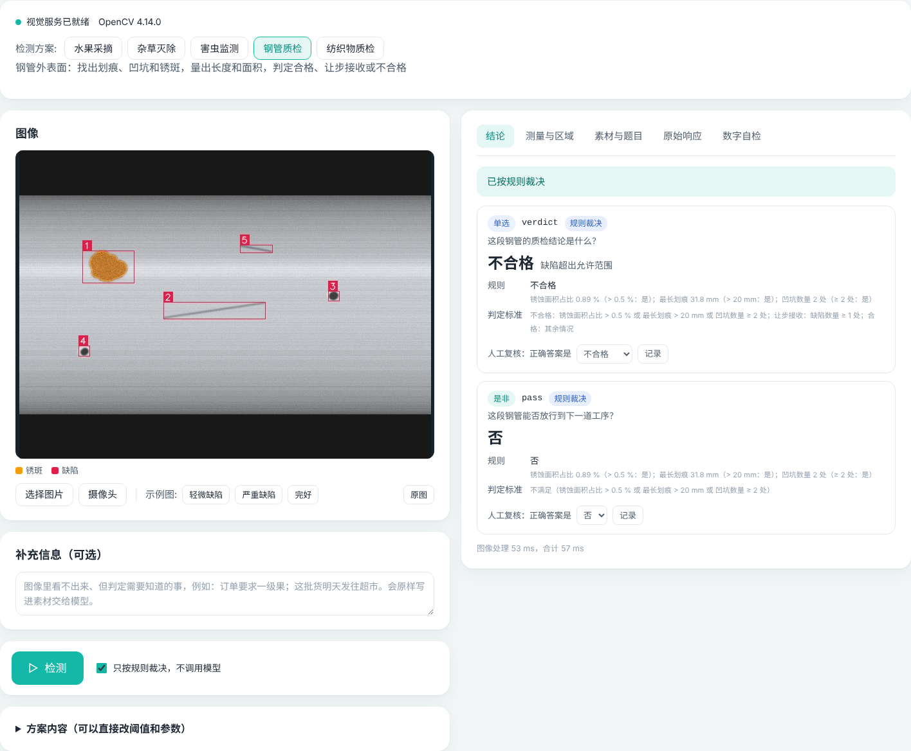

# laya-opencv

> 原名 laya-workbench（Laya 工作台）。

**中文** | [English](README.en.md)

判定模型的本地工作台和一键安装包，支持 Windows 和 Linux，界面有中文和英文两个版本。2.0 起加入视觉检测：用 OpenCV 看图和测量，用判定模型下结论，可以用在农业和质检场景。

[Laya](https://github.com/NandhaKishorM/laya) 和 TypeSafe 的 Jev 都是判定模型：给它一段素材（state）和几道题，它返回每道题的概率分布，而不是生成文本。这个项目把本地 Laya 的安装、启动和一个网页工作台打包在一起，同一份请求可以发给本地模型，也可以发给远程的 Jev 接口。


判定模型只读文本，看不了图。视觉检测的做法是把两者接成一条流水线：

```
图像 → OpenCV 分割、识别、测量 → 数值层（硬规则，写成文字）→ 判定模型 → 规则与模型交叉核对 → 结论
```



上图是「只按规则裁决」模式下的钢管质检，图片是程序合成的示例图。

## 功能

- 一键安装：自动建虚拟环境，按显卡情况安装 PyTorch 和 `laya[serve]`，以及视觉组件（OpenCV，可选）
- 视觉检测：上传图片、摄像头拍照或用示例图，按检测方案量出面积、数量、长度、占比，再逐题给出结论
- 五个内置检测方案：水果采摘、杂草灭除、害虫监测、钢管质检、纺织物质检；方案是 JSON 文件，可以在页面上改
- 数值层：数字相关的结论由硬规则决定，模型的答案用来交叉核对；冲突、临界、低置信度时提示人工复核
- 模型训练：在页面上按类别上传样本，训练出给区域分类的识别模型（OpenCV 的 `cv2.ml`，CPU 上几秒到几十秒）
- 数字自检：自动生成阈值两侧的边界用例，实测判定模型对数字的判断力
- 自动更新：每次启动检查 Laya 有没有新版本，有就自动升级，升级后起不来会自动回退
- 网页工作台：素材支持文本、JSON 对象、消息列表；题目支持是非、单选、打分
- 多种接口：自动、本地 Laya、TypeSafe 官方、aiask.me 网络加速，以及任何提供 `/v1/systemone` 的第三方接口
- 密钥在页面上添加、修改、删除，只保存在本机
- 远程接口失败时自动切换，批量请求自动拆成逐条调用
- 中文、英文两种界面，页面右上角随时切换
- 8 个内置示例（中英文各一套），往 `examples/` 里放 JSON 文件即可增加
- 结果、原始响应、请求 JSON、代码片段（curl / Python / JavaScript）、历史记录、调试面板
- 启动器只用 Python 标准库；视觉组件只依赖 OpenCV 和 numpy，不装也不影响文本判定

## 安装和启动

从 [Releases](../../releases) 页面下载最新的安装包。

### Windows

1. 解压 `laya-opencv-*.zip` 到一个固定位置，例如 `D:\laya-opencv`
2. 双击 `install.bat`，等它跑完
3. 双击 `start.bat`，浏览器自动打开 <http://127.0.0.1:8090>

### Linux

```bash
tar -xzf laya-opencv-*.tar.gz
cd laya-opencv
bash install.sh
bash start.sh
```

需要 Python 3.10 或更高版本。Debian / Ubuntu 先执行 `sudo apt install python3 python3-venv`。

没有桌面的服务器，在自己的电脑上开一个 SSH 隧道，再用本机浏览器打开 <http://127.0.0.1:8090>：

```bash
ssh -L 8090:127.0.0.1:8090 用户名@服务器地址
```

首次启动要下载本地模型（multilingual 约 650 MB）。页面左上方显示「本地 Laya 已就绪」后就可以运行。关闭启动窗口或按 Ctrl+C 即停止全部服务。

### 只用远程接口

不想在这台机器上装本地模型时，先把 `config.example.json` 复制为 `config.json`，把 `install_local_laya` 和 `start_local_laya` 改成 `false`，再运行安装脚本。这样会跳过 PyTorch 和 Laya，只装视觉组件（约 80 MB）。连视觉检测也不需要的话，把 `install_vision` 也改成 `false`，几秒钟装完。

## 视觉检测

页面顶部有三个页签：「文本判定」是原来的工作台，「视觉检测」和「模型训练」是新增的。

### 用法

1. 打开「视觉检测」，选一个检测方案
2. 选择图片、用摄像头拍一张，或者点「示例图」先试一遍
3. 点「检测」。右边依次是：结论、测量与区域、发给模型的素材与题目、原始响应、数字自检

没有判定模型（没装本地 Laya、也没有远程密钥）时也能用：勾选「只按规则裁决」，或者直接检测，绑定了规则的题目照样有结论。

### 内置检测方案

| 方案 | 量什么 | 规则判什么 |
|---|---|---|
| 水果采摘 | 成熟色占比、病斑占比、果径 | 是否采摘、果实等级 |
| 杂草灭除 | 行间杂草的覆盖率、株数、密度 | 是否除草、处理方式 |
| 害虫监测 | 粘虫板上的虫口总数、大型虫体数量、密度 | 是否防治、防治等级 |
| 钢管质检 | 划痕长度、凹坑数量、锈蚀占比 | 合格 / 让步接收 / 不合格 |
| 纺织物质检 | 缺陷数量、最长缺陷、破洞面积 | 合格 / 降等 / 不合格 |

每个方案另有一两道没有绑定规则的题目（例如「这个果实最合适的去向」「应该怎么处理」），由判定模型综合素材来回答。

内置方案的阈值是演示用的，不是任何行业标准；分割参数是按合成示例图调的。用在真实场景前，请用自己的图片调整参数，把阈值换成自己的标准。方案的完整写法见 [docs/vision.md](docs/vision.md)。

### 数字是怎么保证的

判定模型读的是文本，不做算术，输出也只有是非、单选和打分三种。所以数字相关的结论不交给模型去猜：

- **规则来算**：每个阈值比较都由代码完成，测量值先四舍五入到规定的小数位，显示的数和拿来比较的数是同一个
- **写成文字**：交给模型的素材里，数字旁边带着比较结论，例如 `99.3 %（≥ 70 %：是，高出 29.3）`；题目里的判定标准用同样的写法，逐条对得上
- **规则裁决**：题目绑定硬规则后，以规则的结果为准，模型的答案只用来核对
- **提示复核**：规则与模型不一致、测量值落在临界带内、模型置信度低、图像模糊或过暗过亮时，结论会标成「建议人工复核」
- **实测而不是假设**：「数字自检」会在每个阈值两侧生成边界用例，同一批用例分别以「只给数值」和「带比较结论」两种写法交给模型，报告它和规则的一致率。一致率不够高的题目应保持规则裁决

自检结果取决于你用的模型和版本，请以本机跑出来的为准。自检用例和人工复核记录可以导出成 `{state, questions, gold}` 的 JSONL，供以后微调使用。

### 训练识别模型

传统算法能量颜色、面积、形状，但认不出「这是哪种虫」「这是哪类缺陷」。「模型训练」页用来补上这一步：

1. 新建数据集，按类别上传图片（也可以在检测结果里勾选区域直接加入）。每类至少 2 张，建议 30 张以上
2. 选特征（颜色、纹理、轮廓梯度、形状与大小、深度特征）和分类器（SVM、随机森林、K 近邻），点「开始训练」
3. 看交叉验证的准确率和混淆矩阵
4. 在检测方案的 `pipeline` 里加一步 `{"op": "classify", "model": "模型名字", "on": "regions:区域名"}`

内置方案已经写好了这一步。点结论页里的「用合成样本训练一个示例模型」，就能看到识别结果出现在测量值里。

「深度特征」需要先下载一个预训练的骨干网络（MobileNetV2，约 14 MB，在训练页点一下即可），对外观复杂的目标效果好得多。

密集、互相遮挡的小目标超出了「先分割、再分类」的能力，这时可以把外部训练好的 YOLO 系列 ONNX 检测模型放进 `data/onnx/`，在方案里用 `{"op": "detect", ...}` 引用。

### 一步到位的接口

```bash
curl -s http://127.0.0.1:8090/v1/inspect \
  -H "Content-Type: application/json" -H "X-WB-Target: auto" \
  -d '{"recipe": "steel-pipe", "image": "<base64 或 data URL>", "context": "客户要求表面无锈"}'
```

返回里有测量值、发给模型的素材和题目、每道题的最终结论（`verdicts`）以及是否建议复核（`review`）。不传 `image` 而传 `values`（一组现成的测量值），可以只用数值层和判定模型，把别的传感器数据接进来。

### 限制

- 示例图是程序合成的，比真实照片干净得多；在它上面得到的效果不代表真实场景
- 传统分割对光照和背景敏感，需要固定拍摄条件；方案里的像素参数按 `max_side` 处理尺寸计算
- 识别模型是「特征 + 小分类器」，不是深度检测网络；OpenCV 不能训练 YOLO 这类模型
- 这是验证方案和小批量检测用的工作台，不是产线级的检测系统；它只输出判定，不控制执行机构

## 自动更新

每次运行 `start.bat` / `start.sh`，启动本地模型之前会先检查两样东西：

- **Laya 程序**：和 PyPI 上的最新版本比较，有新版本就自动用 pip 升级，然后再启动。
- **模型文件**：和 Hugging Face 上的最新提交比较。模型文件由 Laya 在加载时自己下载最新版本，这里只是提前告诉你有没有更新。

检查结果会显示在启动窗口里，页面左上方状态行下面也有一行，例如「Laya 0.3.26（已是最新）　模型版本 e4e9ddf2」。

几种情况的处理：

- **连不上网**：跳过检查，继续用当前版本，不影响启动。
- **升级后服务起不来**：自动装回原来的版本并重新启动，同时记住跳过这个版本，等更新的版本发布再升级。
- **新版本需要更新 PyTorch**：升级时会把 PyTorch 固定在当前版本，避免 GPU 版被换成 CPU 版。遇到这种情况升级会失败并提示，继续使用当前版本；重新运行安装脚本即可处理。
- **8000 端口上已有 Laya 服务在运行**：只检查，不升级。

用 `config.json` 的 `auto_update` 控制：`true`（默认，自动升级）、`"check"`（只检查并提示，不升级）、`false`（不检查）。

## 语言

- **页面**：右上角的「中文 / English」随时切换，选择会记住。切换时，没改动过的示例会一起换成对应语言的版本。
- **安装和启动窗口**：默认跟随系统语言。要固定成某种语言，把 `config.json` 的 `language` 改成 `zh` 或 `en`。
- **服务端返回的报错**：跟随页面当前的语言。

## 接口

页面左上角的「接口」下拉框：

| 接口 | 发到哪里 | 密钥 |
|---|---|---|
| 自动（推荐） | 按模型名决定，规则见下 | 用到哪个接口就需要哪个的密钥 |
| 本地 Laya | 本机 `127.0.0.1:8000` | 不需要 |
| TypeSafe 官方 | `https://api.typesafe.ai` | TypeSafe 控制台的密钥 |
| aiask.me 网络加速 | `https://aiask.me` | aiask.me 的密钥 |
| 第三方接口 | 你填写的地址 | 该服务的密钥，没有可以不填 |

**「自动」的规则**

- 模型名是 `multilingual`、`english`、`typed-decisions`，或者留空：用本地 Laya
- 其他模型名（如 `jev-latest`）：按 `auto_order` 的顺序（默认先 aiask.me，再 TypeSafe 官方）找第一个填了密钥的远程接口；它连不上、超时或被拒绝（401 / 403 / 404 / 429 / 5xx）时，自动换下一个再试

结果区会显示这次实际用的是哪个接口，以及换过接口的经过。

**管理密钥**

在「接口」里选中哪个接口，「接口设置」里就只显示那一个接口的设置，不会混在一起：

- 没有密钥时：粘贴密钥，点「添加密钥」
- 已有密钥时：只显示末 4 位，可以「修改」或「删除」（删除前要再确认一次）
- 「测试连接」会用当前密钥取一次模型列表，用来确认地址和密钥是否可用

密钥只写进本机的 `config.json`，由本机启动器加到请求头上，浏览器发出的请求里没有密钥。TypeSafe 和 aiask.me 也可以用环境变量 `TYPESAFE_API_KEY`、`AIASK_API_KEY`。

`config.json` 已经写进 `.gitignore`，不会被提交。

**第三方接口**

在「接口」下拉框里选「＋ 添加第三方接口…」，填写名称、接口地址、密钥和默认模型。任何按 `/v1/systemone` 格式提供服务的地址都可以，例如别的网关，或者内网里另一台机器上的 Laya 服务。

- 接口地址只填到域名或路径前缀，工作台会自动加上 `/v1/systemone`；把完整地址贴进来也会自动去掉结尾
- 密钥可以不填，适合不需要鉴权的内网服务
- 添加后可以改名称、地址、默认模型和密钥，也可以整个删除
- 第三方接口只在被选中时使用，不参与「自动」。想让它参与，把它在 `config.json` 里的 id（如 `custom-1`）加进 `auto_order`

**远程接口和本地 Laya 的差别**

- 远程接口没有批量端点。选「批量」时工作台逐条调用 `/v1/systemone` 再合并结果，按条计费
- `max_len` 只对本地 Laya 生效；置信度阈值对远程接口由工作台在本地判断
- 访问远程接口默认跟随系统代理，要单独指定就填 `config.json` 的 `proxy`

## 示例

`examples/zh/` 和 `examples/en/` 里各有一套示例，页面按当前语言显示对应的一套。每个 `.json` 文件都是一个完整的请求体，对应一个示例按钮：

| 文件 | 内容 |
|---|---|
| `01-ticket-routing.json` | 工单分流：部门、紧急度、流失风险 |
| `02-content-moderation.json` | 内容审核（批量） |
| `03-rag-relevance.json` | RAG 段落相关性 |
| `04-llm-output-check.json` | LLM 输出校验 |
| `05-email-triage.json` | 邮件分拣（JSON 对象素材） |
| `06-prompt-guard.json` | 提示词护栏（消息列表素材） |
| `07-model-routing.json` | 模型路由（批量） |
| `08-confidence-gate.json` | 置信度门控 |

按同样格式再放一个文件进去，刷新页面就多一个按钮。`_title` 是按钮名，`_note` 是一句说明，其余字段就是请求内容。直接放在 `examples/` 下（不进语言子目录）的文件在两种语言下都会显示。

这些文件也可以直接用 curl 发给本地 Laya（以下划线开头的字段会被忽略）：

```bash
curl -s http://127.0.0.1:8000/v1/systemone \
  -H "Content-Type: application/json" \
  --data-binary "@examples/zh/01-ticket-routing.json"
```

Windows PowerShell 里要写 `curl.exe`。带 `states` 的两个批量示例要换成 `/v1/systemone/batch`。

## 配置

首次安装或启动时，会从 `config.example.json` 生成 `config.json`。修改后重新启动生效。

| 配置项 | 说明 |
|---|---|
| `language` | `auto`（跟随系统）/ `zh` / `en`，决定安装和启动窗口的语言，以及页面的默认语言 |
| `ui_host` / `ui_port` | 工作台监听地址和端口，默认 `127.0.0.1:8090` |
| `open_browser` | 启动后是否自动打开浏览器 |
| `install_local_laya` | `false` = 安装时跳过 PyTorch 和 Laya |
| `start_local_laya` | `false` = 启动时不拉起本地模型 |
| `laya_host` / `laya_port` | 本地 Laya 服务地址，默认 `127.0.0.1:8000` |
| `models` | 启动时预载的模型，逗号分隔：`multilingual,english,typed-decisions` |
| `default_model` | 判断不出语言时用哪个模型 |
| `device` | `auto` / `cuda` / `cpu` |
| `api_key` | 本地 Laya 的访问密钥，一般留空 |
| `auto_update` | `true` = 每次启动自动升级 Laya；`"check"` = 只检查并提示；`false` = 不检查 |
| `install_vision` | `false` = 安装时跳过 OpenCV，不提供视觉检测和训练 |
| `start_vision` | `false` = 启动时不拉起视觉服务 |
| `vision_host` / `vision_port` | 视觉服务地址，默认 `127.0.0.1:8001`，只供本机的启动器访问 |
| `vision_backbone_urls` | 骨干网络的下载地址。`auto` = 中文环境先走 hf-mirror.com，再试官方地址；也可以填一个或多个地址（逗号分隔） |
| `providers` | 远程接口：名称、地址、密钥、默认模型 |
| `auto_order` | 「自动」尝试远程接口的顺序 |
| `proxy` | 访问远程接口用的代理，留空 = 跟随系统 |
| `remote_timeout` | 远程请求超时秒数 |
| `hf_endpoint` | 模型下载地址。`auto` = 中文环境用 hf-mirror.com，其他环境直连 Hugging Face；也可以填具体地址或清空 |
| `pip_index` | 安装和自动更新用的 pip 源。`auto` = 中文环境用清华镜像，其他环境用官方源；也可以填具体地址或清空 |
| `torch_index` | 指定 PyTorch 下载源，一般留空 |
| `desktop_shortcut` | Windows 安装时是否创建桌面快捷方式 |

> 把 `ui_host` 改成 `0.0.0.0` 后，能访问这个端口的人都可以用你保存的密钥发请求。请只在可信内网这样做，否则保持 `127.0.0.1` 并用 SSH 隧道。

## 常见问题

**远程接口返回 401 / 403**
密钥不对，或者这个密钥没有所选模型的权限。在「接口设置」里点「测试连接」，能看到这个密钥可用的模型。

**aiask.me 的接口地址不对**
默认按 `https://aiask.me/v1/systemone` 调用。地址不同的话，在「接口设置」里改接口地址（不带 `/v1/systemone`）后保存。

**页面一直显示「本地 Laya 模型加载中」**
看启动窗口：正在下载模型就继续等；有报错就按报错处理。

**端口被占用**
8000 上已有 Laya 服务时工作台会直接使用它。被别的程序占用时，改 `config.json` 的 `laya_port`。视觉服务用 8001，被占用时改 `vision_port`。

**有 NVIDIA 显卡但显示用的是 cpu**
装到的是 CPU 版 PyTorch。到 <https://pytorch.org/get-started/locally/> 选好 CUDA 版本，用虚拟环境里的 `python -m pip` 重装 torch 后重新启动。

**「视觉检测」页显示视觉组件未安装**
重新运行安装脚本，它会补装 OpenCV。`config.json` 里 `install_vision` 和 `start_vision` 都要是 `true`。

**提示这个 OpenCV 不带训练模块**
OpenCV 5 的主包去掉了 `cv2.ml`。重新运行安装脚本会换成 4.x；手动安装用 `pip install "opencv-python-headless<5"`。

**骨干网络下载失败**
手动下载任意一个图像分类网络的 `.onnx` 文件（例如 OpenCV Zoo 的 MobileNetV2），放进 `data/backbones/` 即可。

**检测结果和预期差得远**
先看「测量与区域」页签和标注图，确认分割对不对；再展开「方案内容」调整颜色范围、面积下限等参数，点「应用修改」后重新检测。

**安装中途失败**
修复后重新运行安装脚本，已完成的步骤会自动跳过。

## 目录结构

```
install.bat / install.sh   安装
start.bat / start.sh       启动
config.example.json        配置模板
examples/zh/  examples/en/ 示例请求（中文 / 英文）
recipes/zh/  recipes/en/   检测方案（中文 / 英文）
app/workbench.html         工作台页面（含中英文文案）
app/vision.js              视觉检测页和模型训练页
app/launcher.py            启动器：拉起本地服务、提供页面、转发请求、编排检测流程
app/numeric.py             数值层：测量规格、硬规则、文字化、裁决、自检用例
app/vision_server.py       视觉服务（本机 HTTP 接口）
app/vision_core.py         分割、区域、测量、标注
app/vision_train.py        特征提取、训练、模型管理
app/vision_demo.py         合成示例图和训练样本
app/install.py             安装逻辑
app/wb_lang.py             语言选择
tests/                     测试；mock_laya.py 是测试用的假 Laya 服务
data/                      运行时生成：训练图片、模型、骨干网络、自检和复核记录（不进版本库）
```

## 发布新版本

推送一个 `v` 开头的标签，GitHub Actions 会自动打包并创建 Release：

```bash
git tag v2.0.0
git push origin v2.0.0
```

## 卸载

删除整个文件夹（训练图片和模型在里面的 `data/` 下）；Windows 上再删掉桌面的「laya-opencv」快捷方式。模型缓存在用户目录的 `.cache/huggingface` 下，不需要时可以一并删除。

## 许可

本项目的代码以 MIT 许可发布。Laya 模型和 TypeSafe、aiask.me 的接口各自遵循其自己的许可和服务条款。OpenCV 以 Apache-2.0 许可发布；按需下载的 MobileNetV2 骨干网络来自 OpenCV Zoo。自己放进来的检测模型遵循它本身的许可，例如 Ultralytics YOLO 是 AGPL-3.0。
