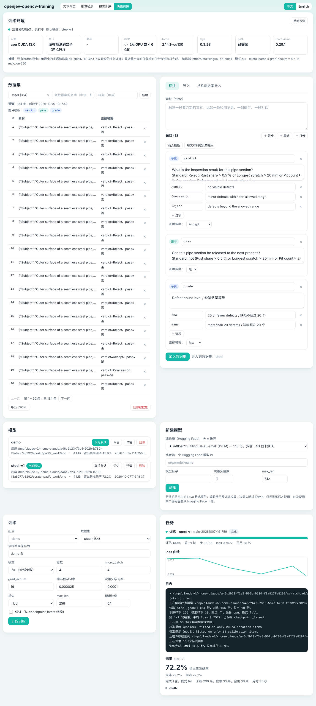
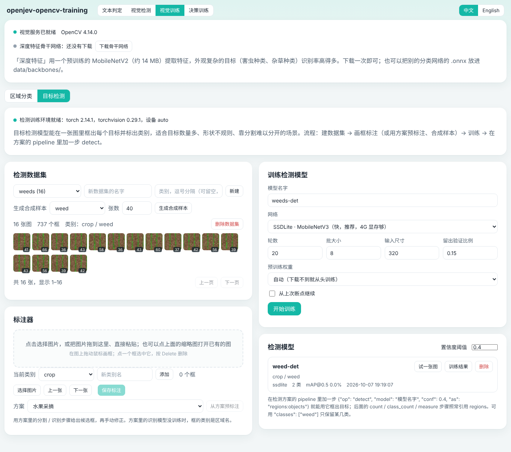

# laya-opencv

> 原名 laya-workbench（Laya 工作台）。3.0 是 2.0 的升级版：原有功能全部保留，新增决策模型训练和目标检测训练。

**中文** | [English](README.en.md)

判定模型的本地工作台和一键安装包，支持 Windows 和 Linux，界面有中文和英文两个版本。2.0 的文本判定和视觉检测之上，3.0 加上了**自己训练模型**的能力：

- **决策模型训练（「开源版 JEV」）**：用任意 Hugging Face 编码器新建一个 Laya 格式的决策模型，或者在官方 Laya 权重上微调；用自己的数据训练、评估，然后设为默认模型。训练出来的模型由本项目自己的服务端提供，接口仍然是 `/v1/systemone`，文本判定页、视觉检测的 pipeline、第三方程序都可以直接用。4 GB 显存的显卡就能训练小模型，没有显卡也能用 CPU 训练。
- **目标检测训练**：在原有「分割 + 小分类器」之外，用 torchvision 训练能在一张图里框出每个目标的检测模型（SSDLite / Faster R-CNN），并作为检测方案 pipeline 里的一步使用。

[Laya](https://github.com/NandhaKishorM/laya) 和 TypeSafe 的 Jev 都是判定模型：给它一段素材（state）和几道题，它返回每道题的概率分布，而不是生成文本。Laya 公开了权重和训练代码，但只给了三套官方权重；「开源版 JEV」就是把「换一个编码器、用自己的数据训出一个同样接口的判定模型」这件事做成页面上的几步操作。这个项目把本地模型的安装、启动、训练和一个网页工作台打包在一起，同一份请求可以发给本地模型，也可以发给远程的 Jev 接口。


判定模型只读文本，看不了图。视觉检测的做法是把两者接成一条流水线：

```
图像 → OpenCV 分割、识别、检测、测量 → 数值层（硬规则，写成文字）→ 判定模型 → 规则与模型交叉核对 → 结论
```


上图是「只按规则裁决」模式下的钢管质检，图片是程序合成的示例图。



「决策训练」页：训练环境、数据集与标注器、模型列表、训练任务。截图是在没有显卡的机器上用演示数据跑的。

## 功能

- 一键安装：自动建虚拟环境，按显卡情况安装 PyTorch 和锁定版本的 `laya[serve]`，训练组件（torchvision、peft，可选）和视觉组件（OpenCV，可选）；装完探测显卡、显存和训练档位
- 决策模型训练：在页面上标注或导入数据，从 11 个内置编码器（或任意 Hugging Face 模型 id）新建模型，全参数 / 冻结词嵌入 / LoRA 三种模式训练，显存不足自动降档，断点续训，留出集评估，一键设为默认模型
- 决策模型服务：本项目自己的服务端同时提供官方 Laya 权重和自己训练的模型，请求里用 `model` 字段指定；可以完全不下载官方权重
- 目标检测训练：画框标注（或从检测方案预标注、生成合成样本），训练 SSDLite / Faster R-CNN，试一张图，在方案里用 `{"op": "detect"}` 引用
- 视觉检测：上传图片、摄像头拍照或用示例图，按检测方案量出面积、数量、长度、占比，再逐题给出结论
- 五个内置检测方案：水果采摘、杂草灭除、害虫监测、钢管质检、纺织物质检；方案是 JSON 文件，可以在页面上改
- 数值层：数字相关的结论由硬规则决定，模型的答案用来交叉核对；冲突、临界、低置信度时提示人工复核
- 区域分类训练：在页面上按类别上传样本，训练出给区域分类的识别模型（OpenCV 的 `cv2.ml`，CPU 上几秒到几十秒）
- 数字自检：自动生成阈值两侧的边界用例，实测判定模型对数字的判断力；自检用例和复核记录可以直接导入决策训练的数据集
- 自动更新：每次启动检查 Laya 有没有新版本；锁定了版本时只提示不升级（训练脚本依赖 Laya 的内部接口），升级后起不来会自动回退
- 网页工作台：素材支持文本、JSON 对象、消息列表；题目支持是非、单选、打分
- 多种接口：自动、本地 Laya、TypeSafe 官方、aiask.me 网络加速，以及任何提供 `/v1/systemone` 的第三方接口
- 密钥在页面上添加、修改、删除，只保存在本机
- 远程接口失败时自动切换，批量请求自动拆成逐条调用
- 中文、英文两种界面，页面右上角随时切换
- 8 个内置示例（中英文各一套），往 `examples/` 里放 JSON 文件即可增加
- 结果、原始响应、请求 JSON、代码片段（curl / Python / JavaScript）、历史记录、调试面板
- 启动器只用 Python 标准库；视觉组件只依赖 OpenCV 和 numpy；需要 torch 的训练和推理都在子进程里，不装也不影响其余功能

## 安装和启动

从 [Releases](../../releases) 页面下载最新的安装包。

### Windows

1. 解压 `laya-opencv-*.zip` 到一个固定位置，例如 `D:\laya-opencv`
2. 双击 `install.bat`，等它跑完
3. 双击 `start.bat`，浏览器自动打开 <http://127.0.0.1:8090>

### Linux

```bash
tar -xzf laya-opencv-*.tar.gz
cd laya-opencv
bash install.sh
bash start.sh
```

需要 Python 3.10 或更高版本。Debian / Ubuntu 先执行 `sudo apt install python3 python3-venv`。

没有桌面的服务器，在自己的电脑上开一个 SSH 隧道，再用本机浏览器打开 <http://127.0.0.1:8090>：

```bash
ssh -L 8090:127.0.0.1:8090 用户名@服务器地址
```

首次启动要下载官方模型（multilingual 约 650 MB）。页面左上方显示「本地 Laya 已就绪」后就可以运行。关闭启动窗口或按 Ctrl+C 即停止全部服务。自己训练的模型设为默认之后，就不再需要官方模型（把 `decision_builtin` 清空即可，见「配置」）。

### 安装脚本做了什么

安装脚本可以重复运行，已装好的部分会跳过。完整安装的步骤：

```
[1/9] 准备虚拟环境 (.venv)
[2/9] 安装 PyTorch                       有 NVIDIA 显卡装 GPU 版（约 2~3 GB），否则装 CPU 版
[3/9] 安装 Laya 和服务端组件             laya[serve]==<laya_version>，默认锁定 0.3.28
[4/9] 安装训练组件（torchvision、peft）  torchvision 用和 torch 同一个构建（CUDA / CPU）
[5/9] 检查安装结果                       laya / torch / torchvision / peft 版本，GPU 是否可用
[6/9] 探测显卡与训练档位                 显卡、显存、档位（small / base / large）和推荐参数 → data/decision/gpu.json
[7/9] 下载目标检测的预训练权重（可选）   mobilenet_v3_large（约 22 MB）→ ~/.cache/torch/hub/checkpoints/，失败只提示
[8/9] 安装视觉组件（OpenCV）
[9/9] 收尾                               Windows 上创建桌面快捷方式「laya-opencv」
```

中文环境下 pip 自动走清华镜像，模型下载走 hf-mirror.com；预训练权重没有国内镜像，下载失败时会打印手动放置的路径，训练时也会再试一次。

### 只用远程接口

不想在这台机器上装本地模型时，先把 `config.example.json` 复制为 `config.json`，把 `install_local_laya` 和 `start_local_laya` 改成 `false`，再运行安装脚本。这样会跳过 PyTorch、Laya 和训练组件，只装视觉组件（约 80 MB）。连视觉检测也不需要的话，把 `install_vision` 也改成 `false`，几秒钟装完。

### 不装训练组件

只想用本地模型判定、不训练的话，把 `install_training` 改成 `false`：不装 torchvision 和 peft，决策训练页仍然可以管理数据集和用 full / freeze 模式训练，目标检测训练和 LoRA 模式不可用。

## 决策模型训练

页面顶部第四个页签「决策训练」。整个流程：**探测环境 → 准备数据集 → 新建模型（或选官方权重）→ 训练 → 评估 → 设为默认 → 在文本判定 / 视觉检测里使用**。命令行用法和细节见 [docs/decision-training.md](docs/decision-training.md)。

### 环境探测与显存档位

安装脚本和「训练环境」卡片都会探测显卡，按显存分档，给出推荐参数（`app/decision_train.py probe`）：

| 显存 | 档位 | 推荐编码器 | 推荐模式 | micro_batch × grad_accum | max_len | amp |
|---|---|---|---|---|---|---|
| 无 GPU（CPU） | small | multilingual-e5-small | full | 4 × 16 | 256 | 关 |
| 不到 6 GB | small | multilingual-e5-small | full；base 级编码器用 lora | 2 × 32 | 384 | 开 |
| 6 – 11 GB | base | multilingual-e5-base / mmBERT-base | full；large 级用 lora | 4 × 16 | 512 | 开 |
| 11 GB 以上 | large | ModernBERT-large / 官方 Laya 权重 | full | 8 × 8 | 512 | 开 |

有效 batch = micro_batch × grad_accum，各档位都是 64。页面上的训练表单会按档位填好默认值，可以随时改。

**关于 4 GB 显卡**：本项目开发时没有 GPU，在 CPU 上实测通过的是整条流程——用一个小编码器 `new` 建模、`train` 的 full / lora 两种模式、OOM 自动降档（用环境变量模拟显存不足）、`--resume` 续训、`evaluate`、把训练好的模型挂到服务端用 `/v1/systemone` 请求。表里的显存档位和推荐参数是按编码器参数量、序列长度和混合精度估算的，不是在 4 GB 显卡上跑出来的数；在你的机器上第一次训练时请先用默认值，显存不足时程序会自动把 micro batch 减半、再缩短 max_len，页面上能看到每次降档。

### 数据集

一条训练数据 = 一段素材 + 几道题 + 每道题的正确答案，和文本判定页的请求格式一样（JSONL，每行一个对象）：

```json
{"state": "钢管表面检测：缺陷占比 8.3%，缺陷数量 31 个。",
 "questions": {
   "pass":  {"type": "noul",   "instructions": "该钢管是否合格？"},
   "grade": {"type": "choice", "instructions": "缺陷数量等级", "criteria": {"few": "不超过 20 个", "many": "超过 20 个"}},
   "score": {"type": "score",  "instructions": "外观评分", "levels": ["差", "中", "好"]}
 },
 "expected": {"pass": false, "grade": "many", "score": 1}}
```

`type` 是 `noul`（是非，答案 true / false）、`choice`（答案是 `criteria` 的 key）、`score`（答案是 `levels` 的下标或文本）。页面上有四种来源：

1. **标注器**：粘一段素材，加题目（题目组件和文本判定页一样，也可以「载入模板」或「用文本判定页的题目」），每题选正确答案，「加入数据集」
2. **导入**：粘贴或上传 JSONL（`expected` 和 laya-opencv 导出的 `gold` 两种写法都认），或者 CSV（`text,label` 两列 → 自动变成一道单选题，题目文本自己填）
3. **从检测方案导入**：把「视觉检测」页数字自检的边界用例和人工复核记录变成训练数据——先在视觉检测页跑几次自检、复核几条，再回来导入
4. 直接把 JSONL 放到 `data/decision/datasets/<名字>.jsonl`

数据集可以分页查看、删行、导出。几十条就能训出一个能用的模型做验证，几百条以上准确率才稳定。

### 新建模型

「新建模型」从一个编码器建出一个空白的 Laya 格式模型（编码器用预训练权重，决策头随机初始化，必须训练后才能用）。内置的推荐编码器（`app/decision_train.py encoders`）：

| 编码器 | 档位 | 参数量 | 语言 | 说明 |
|---|---|---|---|---|
| `intfloat/multilingual-e5-small` | small | 1.18 亿 | 多语 | 4 GB 显卡和 CPU 的默认选择 |
| `sentence-transformers/paraphrase-multilingual-MiniLM-L12-v2` | small | 1.18 亿 | 多语 | 句向量模型 |
| `BAAI/bge-small-zh-v1.5` | small | 0.24 亿 | 中文 | 最小 |
| `BAAI/bge-base-zh-v1.5` | base | 1.02 亿 | 中文 | |
| `intfloat/multilingual-e5-base` | base | 2.78 亿 | 多语 | |
| `jhu-clsp/mmBERT-base` | base | 3.07 亿 | 多语 | Laya multilingual 用的底座 |
| `answerdotai/ModernBERT-base` | base | 1.49 亿 | 英文 | |
| `answerdotai/ModernBERT-large` | large | 3.95 亿 | 英文 | |
| `convaiinnovations/laya-multilingual` | base | 3.07 亿 | 多语 | 官方 Laya 多语权重，作为微调起点 |
| `convaiinnovations/laya` | large | 3.95 亿 | 英文 | 官方 Laya 英文权重，作为微调起点 |
| `convaiinnovations/laya-typed-decisions` | large | 3.95 亿 | 英文 | 官方 typed-decisions 权重，作为微调起点 |

也可以填任意 Hugging Face 上的编码器 id（BERT / RoBERTa / XLM-R / ModernBERT 一类的双向编码器都行）或本地目录。三个官方权重不需要「新建」，直接在训练表单的「起点」里选，首次用时会下载。编码器按 `hf_endpoint` 下载，中文环境走 hf-mirror.com。

### 训练

训练表单：起点（已有模型 / 官方权重）、数据集、模式、轮数、micro_batch、grad_accum、编码器和决策头的学习率、损失（`rlcd` 是 Laya 默认的强化学习式损失，`soft-ce` 是软交叉熵）、max_len、留出比例、续训。

- **模式** `full`：全部参数都训；`freeze`：冻结编码器的词嵌入，其余照训（比 Laya 自带的「冻结整个编码器」温和，4 GB 上 base 级模型可用）；`lora`：用 peft 给编码器加 LoRA 适配层（`r` 默认 16），只训适配层和决策头，显存省得多；**保存前会把 LoRA 合并回权重**，落盘的仍是普通 Laya 模型，推理端无感
- **显存不足自动降档**：捕获 OOM 后 micro_batch 减半（grad_accum 翻倍，有效 batch 不变），最小到 1；仍然 OOM 就把 max_len 降到 384、256；再不行才报错，并建议换 lora 或更小的编码器
- **断点续训**：每轮结束保存 `checkpoint_latest`；勾选「续训」会从它继续训到目标轮数（`train.json` 里记着已完成的轮数）
- **训练期间模型服务暂停**：在 GPU 上训练时，启动器会先停掉本地决策服务释放显存，文本判定页显示「模型服务已暂停：正在训练」，训练结束（成功或失败）自动恢复
- 进度条、阶段、轮 / 步、loss 曲线、日志尾部都在「任务」卡片里，可以取消；同时只跑一个训练类任务（新建 / 训练 / 评估共用一把锁）
- 训练结束自动做温度校准（和 Laya 一样），有留出集时给出留出集准确率，结果卡显示准确率、校准、显存峰值、用时

### 评估

模型列表里点「评估」，选一个数据集，得到总准确率、按题型（是非 / 单选 / 打分）和按题目的准确率，以及混淆矩阵。请用没有参与训练的数据评估。

### 设为默认，然后使用

「设为默认」把模型名写进 `config.json` 的 `decision_active`，并重启本地决策服务。之后：

- **文本判定**页：顶部「模型」框旁边的下拉按钮列出服务里注册的官方模型和自训练模型（自训练的标着「自训练」，默认的标着「当前默认」），点一下就填进去；留空时提示会写明「留空 = 使用默认模型 <名字>」（`decision_pin_default` 为 true 时没指定模型的请求都用它）
- **视觉检测**：「模型」卡的「决策模型」下拉和顶部那个框是同一个值，选哪个都行；也可以把模型名写进方案的 `model` 字段
- **第三方程序**：`POST http://127.0.0.1:8000/v1/systemone`，请求体加 `"model": "模型名"`，格式与 Laya 完全相同；`GET /v1/models` 列出所有已注册的模型
- 不想再下载官方权重：`decision_builtin` 设为 `""`，服务端只注册自己的模型

模型目录 `data/decision/models/<名字>/` 就是一个标准的 Laya checkpoint（`model.safetensors`、`rl_agent_config.json`、`encoder/`、`tokenizer/`、`questions.json`、`train.json`），可以拷到别的机器用 Laya 自己的 `python -m laya.serve` 或本项目的 `decision_server.py` 加载。

### 命令行

页面做的每一步都对应 `app/decision_train.py` 的一个子命令，stdout 每行一个 JSON 事件（`start` / `log` / `progress` / `oom` / `result` / `error`），适合写脚本：

```bash
P=.venv/bin/python   # Windows: .venv\Scripts\python.exe
$P app/decision_train.py probe
$P app/decision_train.py encoders
$P app/decision_train.py new --encoder intfloat/multilingual-e5-small --out data/decision/models/my-model
$P app/decision_train.py train --data data/decision/datasets/demo.jsonl --base data/decision/models/my-model \
      --out data/decision/models/my-model-v1 --mode full --epochs 4 --micro-batch 2 --grad-accum 32 --max-len 384 --holdout 0.1
$P app/decision_train.py train --data ... --base multilingual --out data/decision/models/laya-ft --mode lora   # 微调官方权重
$P app/decision_train.py train --data ... --out data/decision/models/my-model-v1 --epochs 8 --resume           # 续训到 8 轮
$P app/decision_train.py evaluate --data data/decision/datasets/test.jsonl --model data/decision/models/my-model-v1
$P app/decision_train.py info --model data/decision/models/my-model-v1
$P app/decision_server.py --port 8000 --builtin "" --custom my=data/decision/models/my-model-v1 --default my --pin-default
```

全部参数见 [docs/decision-training.md](docs/decision-training.md)。

## 目标检测训练

「视觉训练」页分两个子页：**区域分类**（原来的「模型训练」，cv2.ml 小分类器）和**目标检测**（新增）。目标检测模型能在一张图里框出每个目标并标出类别，适合目标多、形状不规则、靠分割难以分开的场景。需要 `install_training`（torch + torchvision）。



截图是在 CPU 上用合成样本跑的 1 轮冒烟测试，mAP 为 0 是正常的；真正训练请按下面的参数。

### 数据集

```
data/det/datasets/<名字>/images/*.jpg      图片
data/det/datasets/<名字>/labels/*.txt      YOLO 格式：每行 class_id cx cy w h（0~1 归一化）
data/det/datasets/<名字>/classes.json      ["crop", "weed"]
data/det/models/<名字>/model.pt + meta.json
```

这就是 YOLO 系列通用的标注格式，用 LabelImg、Roboflow 等工具标好的数据可以直接拷进来（记得加 `classes.json`）。页面上：

- **标注器**：选一张图（或点缩略图打开已有的图）→ 在图上拖动画框 → 选类别 → 保存；点框选中后可以改类别或按 Delete 删除，上一张 / 下一张
- **从方案预标注**：用现有检测方案的分割 / 识别步骤给出候选框，再手动修正
- **生成合成样本**：用五个内置场景生成带框的演示数据，用来先把流程跑通

### 训练

参数：网络（`ssdlite` = SSDLite320-MobileNetV3，快、4 GB 显存够，默认；`fasterrcnn_mobile` = Faster R-CNN MobileNetV3-320-FPN，略准、略慢）、轮数（默认 20）、批大小（默认 8）、输入尺寸（默认 320）、留出验证比例、预训练权重（`auto` 下载不到就从头训练并提示；`yes` 下载不到就报错；`no` 从头训练）、续训。训练在子进程 `app/detect_train.py` 里跑，进度和日志显示在页面上，可以取消；显存不足自动把批大小减半重试。训练完给出留出集上的 mAP@0.5 和每类 AP，可以「试一张图」看框。4 GB 显存、batch 8、imgsz 320 这组默认值是估算的（和决策训练一样，本项目在 CPU 上验证了流程），显存不足时会自动降。

**预训练权重**：torchvision 的 ImageNet 骨干权重 `mobilenet_v3_large-8738ca79.pth`（约 22 MB）。安装脚本会尝试下载到 `~/.cache/torch/hub/checkpoints/`（Windows 是 `%USERPROFILE%\.cache\torch\hub\checkpoints\`；环境变量 `TORCH_HOME` 可以改）。没有国内镜像，下载失败就手动下载 <https://download.pytorch.org/models/mobilenet_v3_large-8738ca79.pth> 放到那个目录。从头训练也能收敛，只是需要更多轮数、精度低一些。

### 在方案里使用

在检测方案的 `pipeline` 里加一步：

```json
{"op": "detect", "model": "weed-det", "conf": 0.4, "classes": ["weed"], "as": "regions:weeds"}
```

产出的区域和分割产出的区域结构一样（带 `label` 和 `prob`），后面的 `count` / `class_count` / `measure` / `classify` 步骤照常引用。模型不存在或没装 torch 时，这一步产出零个区域并在 `notes` 里记 `model_missing:<name>`，依赖它的测量值记为「没有测到」，规则裁决不受影响。推理在视觉服务里按需加载 torch，首次调用慢几秒。

外部训练好的 YOLO 系列 ONNX 检测模型仍然可以放到 `data/onnx/`，用 `{"op": "detect", "model_file": ...}` 引用（见 [docs/vision.md](docs/vision.md)）。本项目的训练用的是 torchvision（BSD-3 许可）的模型，**没有用 Ultralytics**，训练出的模型可以自由商用。

## 视觉检测

页面顶部有四个页签：「文本判定」是原来的工作台，「视觉检测」「视觉训练」「决策训练」是扩展出来的。

### 用法

1. 打开「视觉检测」，选一个检测方案
2. 选择图片、用摄像头拍一张，或者点「示例图」先试一遍
3. 点「检测」。右边依次是：结论、测量与区域、发给模型的素材与题目、原始响应、数字自检

没有判定模型（没装本地 Laya、也没有远程密钥）时也能用：勾选「只按规则裁决」，或者直接检测，绑定了规则的题目照样有结论。

### 使用训练好的模型

方案内容上方有一张「模型」卡，不用手改 JSON：

- **决策模型**：和页面顶部的「模型」框是同一个值，列出服务里注册的官方模型和自训练模型（标有「自训练」「当前默认」），留空 = 默认模型
- **区域分类模型**：选一个「视觉训练 → 区域分类」训练出的模型和要应用的区域组，点「加入方案」，会在产出该区域组的步骤后面插入（或替换）一步 `classify`
- **检测模型**：选一个「视觉训练 → 目标检测」训练出的模型，填输出区域组名和置信度，点「加入方案」，会在 pipeline 开头插入（或替换）一步 `detect`；勾选「同时添加计数测量项」会顺带加一个 `count` 测量值
- 卡片下方列出方案里已有的 classify / detect 步骤，可以「移除」。改动只在当前页面生效，点「检测」即可看到；要长期保留请「另存为我的方案」

### 内置检测方案

| 方案 | 量什么 | 规则判什么 |
|---|---|---|
| 水果采摘 | 成熟色占比、病斑占比、果径 | 是否采摘、果实等级 |
| 杂草灭除 | 行间杂草的覆盖率、株数、密度 | 是否除草、处理方式 |
| 害虫监测 | 粘虫板上的虫口总数、大型虫体数量、密度 | 是否防治、防治等级 |
| 钢管质检 | 划痕长度、凹坑数量、锈蚀占比 | 合格 / 让步接收 / 不合格 |
| 纺织物质检 | 缺陷数量、最长缺陷、破洞面积 | 合格 / 降等 / 不合格 |

每个方案另有一两道没有绑定规则的题目（例如「这个果实最合适的去向」「应该怎么处理」），由判定模型综合素材来回答。

内置方案的阈值是演示用的，不是任何行业标准；分割参数是按合成示例图调的。用在真实场景前，请用自己的图片调整参数，把阈值换成自己的标准。方案的完整写法见 [docs/vision.md](docs/vision.md)。

### 数字是怎么保证的

判定模型读的是文本，不做算术，输出也只有是非、单选和打分三种。所以数字相关的结论不交给模型去猜：

- **规则来算**：每个阈值比较都由代码完成，测量值先四舍五入到规定的小数位，显示的数和拿来比较的数是同一个
- **写成文字**：交给模型的素材里，数字旁边带着比较结论，例如 `99.3 %（≥ 70 %：是，高出 29.3）`；题目里的判定标准用同样的写法，逐条对得上
- **规则裁决**：题目绑定硬规则后，以规则的结果为准，模型的答案只用来核对
- **提示复核**：规则与模型不一致、测量值落在临界带内、模型置信度低、图像模糊或过暗过亮时，结论会标成「建议人工复核」
- **实测而不是假设**：「数字自检」会在每个阈值两侧生成边界用例，同一批用例分别以「只给数值」和「带比较结论」两种写法交给模型，报告它和规则的一致率。一致率不够高的题目应保持规则裁决

自检结果取决于你用的模型和版本，请以本机跑出来的为准。自检用例和人工复核记录可以导出成 `{state, questions, gold}` 的 JSONL，也可以在「决策训练」页一键导入成数据集，训一个更懂你的数字的模型。

### 训练区域分类模型

传统算法能量颜色、面积、形状，但认不出「这是哪种虫」「这是哪类缺陷」。「视觉训练 → 区域分类」用来补上这一步：

1. 新建数据集，按类别上传图片（也可以在检测结果里勾选区域直接加入）。每类至少 2 张，建议 30 张以上
2. 选特征（颜色、纹理、轮廓梯度、形状与大小、深度特征）和分类器（SVM、随机森林、K 近邻），点「开始训练」
3. 看交叉验证的准确率和混淆矩阵
4. 在检测方案的 `pipeline` 里加一步 `{"op": "classify", "model": "模型名字", "on": "regions:区域名"}`

内置方案已经写好了这一步。点结论页里的「用合成样本训练一个示例模型」，就能看到识别结果出现在测量值里。

「深度特征」需要先下载一个预训练的骨干网络（MobileNetV2，约 14 MB，在训练页点一下即可），对外观复杂的目标效果好得多。

密集、互相遮挡的小目标超出了「先分割、再分类」的能力，这时用上面的「目标检测训练」。

### 一步到位的接口

```bash
curl -s http://127.0.0.1:8090/v1/inspect \
  -H "Content-Type: application/json" -H "X-WB-Target: auto" \
  -d '{"recipe": "steel-pipe", "image": "<base64 或 data URL>", "context": "客户要求表面无锈"}'
```

返回里有测量值、发给模型的素材和题目、每道题的最终结论（`verdicts`）以及是否建议复核（`review`）。不传 `image` 而传 `values`（一组现成的测量值），可以只用数值层和判定模型，把别的传感器数据接进来。

### 限制

- 示例图是程序合成的，比真实照片干净得多；在它上面得到的效果不代表真实场景
- 传统分割对光照和背景敏感，需要固定拍摄条件；方案里的像素参数按 `max_side` 处理尺寸计算
- 区域分类模型是「特征 + 小分类器」，不是深度检测网络；需要框出目标时用目标检测训练
- 这是验证方案和小批量检测用的工作台，不是产线级的检测系统；它只输出判定，不控制执行机构

## 自动更新

每次运行 `start.bat` / `start.sh`，启动本地模型之前会先检查两样东西：

- **Laya 程序**：和 PyPI 上的最新版本比较。`config.json` 里 `laya_version` 非空（默认锁定 `0.3.28`）时只提示不升级，因为训练脚本用到 Laya 的内部接口（`laya.train`、`laya.common`），新版本可能不兼容；想升级就改 `laya_version` 后重新运行安装脚本，或者把它清空恢复原来的自动升级。
- **模型文件**：和 Hugging Face 上的最新提交比较。模型文件由 Laya 在加载时自己下载最新版本，这里只是提前告诉你有没有更新。

检查结果会显示在启动窗口里，页面左上方状态行下面也有一行，例如「Laya 0.3.28（已是最新）　模型版本 e4e9ddf2」。

几种情况的处理：

- **连不上网**：跳过检查，继续用当前版本，不影响启动。
- **升级后服务起不来**：自动装回原来的版本并重新启动，同时记住跳过这个版本，等更新的版本发布再升级。
- **新版本需要更新 PyTorch**：升级时会把 PyTorch 固定在当前版本，避免 GPU 版被换成 CPU 版。遇到这种情况升级会失败并提示，继续使用当前版本；重新运行安装脚本即可处理。
- **8000 端口上已有 Laya 服务在运行**：只检查，不升级。

用 `config.json` 的 `auto_update` 控制：`"check"`（默认，只检查并提示）、`true`（自动升级；`laya_version` 非空时仍然只检查）、`false`（不检查）。

## 语言

- **页面**：右上角的「中文 / English」随时切换，选择会记住。切换时，没改动过的示例会一起换成对应语言的版本。
- **安装和启动窗口**：默认跟随系统语言。要固定成某种语言，把 `config.json` 的 `language` 改成 `zh` 或 `en`。
- **服务端返回的报错和训练日志**：跟随页面当前的语言。

## 接口

页面左上角的「接口」下拉框：

| 接口 | 发到哪里 | 密钥 |
|---|---|---|
| 自动（推荐） | 按模型名决定，规则见下 | 用到哪个接口就需要哪个的密钥 |
| 本地 Laya | 本机 `127.0.0.1:8000` | 不需要 |
| TypeSafe 官方 | `https://api.typesafe.ai` | TypeSafe 控制台的密钥 |
| aiask.me 网络加速 | `https://aiask.me` | aiask.me 的密钥 |
| 第三方接口 | 你填写的地址 | 该服务的密钥，没有可以不填 |

**「自动」的规则**

- 模型名是 `multilingual`、`english`、`typed-decisions`、自己训练的模型名，或者留空：用本地 Laya
- 其他模型名（如 `jev-latest`）：按 `auto_order` 的顺序（默认先 aiask.me，再 TypeSafe 官方）找第一个填了密钥的远程接口；它连不上、超时或被拒绝（401 / 403 / 404 / 429 / 5xx）时，自动换下一个再试

结果区会显示这次实际用的是哪个接口，以及换过接口的经过。

**管理密钥**

在「接口」里选中哪个接口，「接口设置」里就只显示那一个接口的设置，不会混在一起：

- 没有密钥时：粘贴密钥，点「添加密钥」
- 已有密钥时：只显示末 4 位，可以「修改」或「删除」（删除前要再确认一次）
- 「测试连接」会用当前密钥取一次模型列表，用来确认地址和密钥是否可用

密钥只写进本机的 `config.json`，由本机启动器加到请求头上，浏览器发出的请求里没有密钥。TypeSafe 和 aiask.me 也可以用环境变量 `TYPESAFE_API_KEY`、`AIASK_API_KEY`。

`config.json` 已经写进 `.gitignore`，不会被提交。

**第三方接口**

在「接口」下拉框里选「＋ 添加第三方接口…」，填写名称、接口地址、密钥和默认模型。任何按 `/v1/systemone` 格式提供服务的地址都可以，例如别的网关，或者内网里另一台机器上的 Laya 服务。

- 接口地址只填到域名或路径前缀，工作台会自动加上 `/v1/systemone`；把完整地址贴进来也会自动去掉结尾
- 密钥可以不填，适合不需要鉴权的内网服务
- 添加后可以改名称、地址、默认模型和密钥，也可以整个删除
- 第三方接口只在被选中时使用，不参与「自动」。想让它参与，把它在 `config.json` 里的 id（如 `custom-1`）加进 `auto_order`

**远程接口和本地 Laya 的差别**

- 远程接口没有批量端点。选「批量」时工作台逐条调用 `/v1/systemone` 再合并结果，按条计费
- `max_len` 只对本地 Laya 生效；置信度阈值对远程接口由工作台在本地判断
- 访问远程接口默认跟随系统代理，要单独指定就填 `config.json` 的 `proxy`

## 示例

`examples/zh/` 和 `examples/en/` 里各有一套示例，页面按当前语言显示对应的一套。每个 `.json` 文件都是一个完整的请求体，对应一个示例按钮：

| 文件 | 内容 |
|---|---|
| `01-ticket-routing.json` | 工单分流：部门、紧急度、流失风险 |
| `02-content-moderation.json` | 内容审核（批量） |
| `03-rag-relevance.json` | RAG 段落相关性 |
| `04-llm-output-check.json` | LLM 输出校验 |
| `05-email-triage.json` | 邮件分拣（JSON 对象素材） |
| `06-prompt-guard.json` | 提示词护栏（消息列表素材） |
| `07-model-routing.json` | 模型路由（批量） |
| `08-confidence-gate.json` | 置信度门控 |

按同样格式再放一个文件进去，刷新页面就多一个按钮。`_title` 是按钮名，`_note` 是一句说明，其余字段就是请求内容。直接放在 `examples/` 下（不进语言子目录）的文件在两种语言下都会显示。

这些文件也可以直接用 curl 发给本地 Laya（以下划线开头的字段会被忽略）：

```bash
curl -s http://127.0.0.1:8000/v1/systemone \
  -H "Content-Type: application/json" \
  --data-binary "@examples/zh/01-ticket-routing.json"
```

Windows PowerShell 里要写 `curl.exe`。带 `states` 的两个批量示例要换成 `/v1/systemone/batch`。

## 配置

首次安装或启动时，会从 `config.example.json` 生成 `config.json`。修改后重新启动生效。

| 配置项 | 说明 |
|---|---|
| `language` | `auto`（跟随系统）/ `zh` / `en`，决定安装和启动窗口的语言，以及页面的默认语言 |
| `ui_host` / `ui_port` | 工作台监听地址和端口，默认 `127.0.0.1:8090` |
| `open_browser` | 启动后是否自动打开浏览器 |
| `install_local_laya` | `false` = 安装时跳过 PyTorch、Laya 和训练组件 |
| `start_local_laya` | `false` = 启动时不拉起本地模型 |
| `laya_host` / `laya_port` | 本地决策模型服务地址，默认 `127.0.0.1:8000` |
| `laya_version` | 锁定的 Laya 版本，默认 `"0.3.28"`。安装脚本装 `laya[serve]==<它>`；非空时自动更新只检查不升级。清空 = 装最新版、恢复自动升级（训练脚本可能不兼容） |
| `install_training` | `false` = 不装 torchvision 和 peft：没有目标检测训练和决策训练的 lora 模式 |
| `decision_active` | 当前默认的自定义决策模型名，页面上「设为默认」会写它；空 = 用官方模型 |
| `decision_pin_default` | `true`（默认）= 有自定义默认模型时，没指定 `model` 的请求都用它（关掉按语言路由） |
| `decision_builtin` | 决策服务要注册的官方模型，逗号分隔：`multilingual,english,typed-decisions`；`""` = 不注册官方模型、不下载官方权重（纯自训）。没写这个键时沿用 `models` |
| `detect_device` | 目标检测训练和推理用的设备：`auto` / `cuda` / `cpu` |
| `models` | （旧键，`decision_builtin` 缺省时使用）启动时注册的官方模型 |
| `default_model` | 判断不出语言时用哪个官方模型 |
| `device` | 决策模型服务用的设备：`auto` / `cuda` / `cpu` |
| `preload` | 启动时就加载默认模型 |
| `api_key` | 本地决策服务的访问密钥，一般留空 |
| `auto_update` | `"check"`（默认）= 只检查并提示；`true` = 自动升级 Laya（`laya_version` 非空时仍只检查）；`false` = 不检查 |
| `install_vision` | `false` = 安装时跳过 OpenCV，不提供视觉检测和训练 |
| `start_vision` | `false` = 启动时不拉起视觉服务 |
| `vision_host` / `vision_port` | 视觉服务地址，默认 `127.0.0.1:8001`，只供本机的启动器访问 |
| `vision_backbone_urls` | 区域分类「深度特征」骨干网络的下载地址。`auto` = 中文环境先走 hf-mirror.com，再试官方地址；也可以填一个或多个地址（逗号分隔） |
| `providers` | 远程接口：名称、地址、密钥、默认模型 |
| `auto_order` | 「自动」尝试远程接口的顺序 |
| `proxy` | 访问远程接口、下载骨干网络和预训练权重用的代理，留空 = 跟随系统 |
| `remote_timeout` | 远程请求超时秒数 |
| `hf_endpoint` | 模型和编码器的下载地址。`auto` = 中文环境用 hf-mirror.com，其他环境直连 Hugging Face；也可以填具体地址或清空 |
| `pip_index` | 安装和自动更新用的 pip 源。`auto` = 中文环境用清华镜像，其他环境用官方源；也可以填具体地址或清空 |
| `torch_index` | 指定 PyTorch（和 torchvision）下载源，一般留空 |
| `desktop_shortcut` | Windows 安装时是否创建桌面快捷方式 |

环境变量：`LAYA_WB_CONFIG`（config.json 的位置）、`LAYA_WB_DATA`（`data/` 的位置）、`LAYA_WB_LANG`（临时指定语言）、`HF_ENDPOINT`（覆盖 `hf_endpoint`）、`TORCH_HOME`（torchvision 权重缓存位置）。

> 把 `ui_host` 改成 `0.0.0.0` 后，能访问这个端口的人都可以用你保存的密钥发请求。请只在可信内网这样做，否则保持 `127.0.0.1` 并用 SSH 隧道。

## 常见问题

**远程接口返回 401 / 403**
密钥不对，或者这个密钥没有所选模型的权限。在「接口设置」里点「测试连接」，能看到这个密钥可用的模型。

**aiask.me 的接口地址不对**
默认按 `https://aiask.me/v1/systemone` 调用。地址不同的话，在「接口设置」里改接口地址（不带 `/v1/systemone`）后保存。

**页面一直显示「本地 Laya 模型加载中」**
看启动窗口：正在下载模型就继续等；有报错就按报错处理。

**页面显示「模型服务已暂停：正在训练」**
这是正常的：GPU 上训练决策模型时，本地模型服务会停掉以释放显存，训练结束自动恢复。要边训边用，就把 `device` 设成 `cpu`，或者用远程接口。

**端口被占用**
8000 上已有 Laya 服务时工作台会直接使用它。被别的程序占用时，改 `config.json` 的 `laya_port`。视觉服务用 8001，被占用时改 `vision_port`。

**有 NVIDIA 显卡但显示用的是 cpu**
装到的是 CPU 版 PyTorch。到 <https://pytorch.org/get-started/locally/> 选好 CUDA 版本，用虚拟环境里的 `python -m pip` 重装 torch 后重新运行安装脚本（它会补装同构建的 torchvision）。

**训练时显存不足（OOM）**
程序会自动降档（micro batch 减半、max_len 缩短）。还是不行：换 `lora` 模式、换更小的编码器（bge-small-zh / e5-small）、减小 max_len，或者把 `device` 设成 `cpu` 用 CPU 训练小模型。

**训练页说 peft 没有安装 / torchvision 没有安装**
重新运行安装脚本（`install_training` 保持 `true`），它会补装。手动装：`.venv/bin/python -m pip install peft`；torchvision 必须和 torch 同一个构建，见 [docs/decision-training.md](docs/decision-training.md)。

**编码器 / 官方权重下载失败**
中文环境默认走 hf-mirror.com；也可以把 `hf_endpoint` 换成别的镜像，或者在有网的机器上下载好模型目录，`new --encoder <本地目录>` / 训练起点填本地目录。

**目标检测的预训练权重下载失败**
手动下载 <https://download.pytorch.org/models/mobilenet_v3_large-8738ca79.pth> 放到 `~/.cache/torch/hub/checkpoints/`（Windows：`%USERPROFILE%\.cache\torch\hub\checkpoints\`）。或者训练时把预训练权重选成「不用」，从头训练。

**自己训练的模型准确率很低**
先看数据：几十条数据只够验证流程；题目的 `instructions` 和选项说明要写清楚，每类答案都要有足够样本；用留出集评估而不是训练集。官方权重 + lora 微调通常比从小编码器新建更快达到可用水平。

**「视觉检测」页显示视觉组件未安装**
重新运行安装脚本，它会补装 OpenCV。`config.json` 里 `install_vision` 和 `start_vision` 都要是 `true`。

**提示这个 OpenCV 不带训练模块**
OpenCV 5 的主包去掉了 `cv2.ml`。重新运行安装脚本会换成 4.x；手动安装用 `pip install "opencv-python-headless<5"`。

**骨干网络下载失败**
手动下载任意一个图像分类网络的 `.onnx` 文件（例如 OpenCV Zoo 的 MobileNetV2），放进 `data/backbones/` 即可。

**检测结果和预期差得远**
先看「测量与区域」页签和标注图，确认分割对不对；再展开「方案内容」调整颜色范围、面积下限等参数，点「应用修改」后重新检测。

**安装中途失败**
修复后重新运行安装脚本，已完成的步骤会自动跳过。

## 目录结构

```
install.bat / install.sh   安装
start.bat / start.sh       启动
config.example.json        配置模板
examples/zh/  examples/en/ 示例请求（中文 / 英文）
recipes/zh/  recipes/en/   检测方案（中文 / 英文）
app/workbench.html         工作台页面（含中英文文案）
app/vision.js              视觉检测页和视觉训练页（区域分类、目标检测）
app/decision.js            决策训练页
app/launcher.py            启动器：拉起本地服务、提供页面、转发请求、编排检测流程、决策训练接口
app/decision_jobs.py       决策训练的数据集 / 模型 / 后台任务管理（标准库）
app/decision_train.py      决策模型训练 CLI：probe / encoders / new / train / evaluate / info（torch + laya，子进程）
app/decision_server.py     决策模型服务端：官方权重 + 自训模型，/v1/systemone（替代 python -m laya.serve）
app/detect_train.py        目标检测训练 CLI：probe / train / predict（torch + torchvision，子进程）
app/detect_data.py         目标检测的数据集存取（YOLO 格式）和模型查找
app/numeric.py             数值层：测量规格、硬规则、文字化、裁决、自检用例
app/vision_server.py       视觉服务（本机 HTTP 接口）
app/vision_core.py         分割、区域、测量、标注、detect 步骤
app/vision_train.py        区域分类：特征提取、训练、模型管理
app/vision_demo.py         合成示例图和训练样本
app/install.py             安装逻辑
app/wb_lang.py             语言选择
docs/                      方案写法、决策训练参考、截图；CONTRACT.md 是模块接口约定（开发用，不进安装包）
tests/                     测试（CI 只装 OpenCV + numpy）；tests/gpu/ 需要 torch，没装自动跳过
data/                      运行时生成（不进版本库）：
  datasets/ models/          区域分类的样本和模型
  det/datasets/ det/models/  目标检测的数据集（YOLO 格式）和模型
  decision/datasets/         决策训练数据集（JSONL + meta）
  decision/models/<name>/    训练出的决策模型（Laya 格式 checkpoint）
  decision/jobs/ gpu.json    训练日志、显卡探测结果
  backbones/ onnx/           骨干网络、外部 ONNX 检测模型
```

## 发布新版本

推送一个 `v` 开头的标签，GitHub Actions 会跑测试、打包并创建 Release（包名 `laya-opencv-<tag>.zip` / `.tar.gz`，不含测试和开发文档）：

```bash
git tag v3.0.0
git push origin v3.0.0
```

## 卸载

删除整个文件夹（训练数据和模型都在里面的 `data/` 下）；Windows 上再删掉桌面的「laya-opencv」快捷方式。模型和编码器缓存在用户目录的 `.cache/huggingface` 下，目标检测的预训练权重在 `.cache/torch/hub/checkpoints` 下，不需要时可以一并删除。

## 许可

本项目的代码以 MIT 许可发布。依赖的开源组件：[Laya](https://github.com/NandhaKishorM/laya)（Apache-2.0）、PyTorch（BSD-3）、torchvision（BSD-3，目标检测模型和 MobileNetV3 预训练权重）、peft（Apache-2.0）、OpenCV（Apache-2.0；按需下载的 MobileNetV2 骨干网络来自 OpenCV Zoo）。Hugging Face 上的编码器和 Laya 官方权重各自遵循其模型卡上的许可；TypeSafe、aiask.me 的接口遵循各自的服务条款。自己放进来的 ONNX 检测模型遵循它本身的许可，例如 Ultralytics YOLO 是 AGPL-3.0——本项目的目标检测训练没有使用 Ultralytics。
